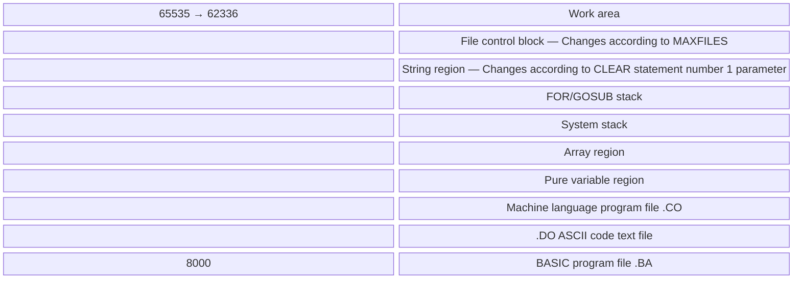
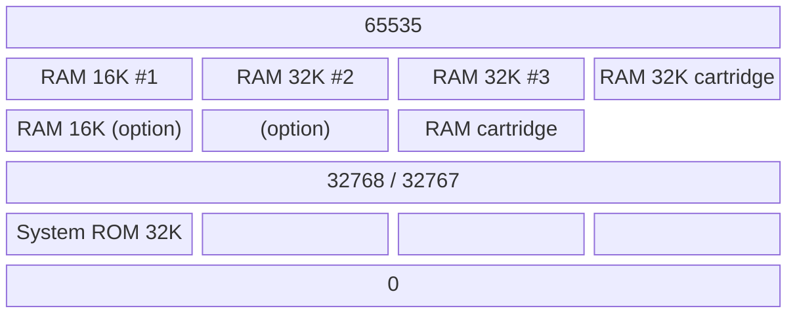

# Appendix B: Memory Maps

> Vision-OCR'd from the image-only scan of NEC8201A-BasicReference.pdf
> (source pages 279–280). Transcribed faithfully and Tier B figure/table pass complete
> (figures rendered, tables checked against the source scan). Remaining
> items needing a human eye are tracked in the BASIC Reference Tier B
> review issue.

## B. Memory Maps

### Map 1 — RAM Address Layout (single-bank view)

**Figure B.1 — RAM address map (8000–65535), high address at top.**

<!-- Figure B.1 reproduces the single-bank RAM map on source p279. Addresses
     verified against scan: top boundary 65535, Work-area lower boundary 62336,
     base 8000. The "Changes according to CLEAR statement number 1 parameter"
     brace in the scan spans String region through System stack. -->

The following table summarises the regions shown in the diagram on source page 279:

| Address Range | Region | Notes |
|---|---|---|
| 62336–65535 | Work area | |
| (below 62336, variable) | File control block | Changes according to MAXFILES |
| (variable) | String region | Changes according to CLEAR statement number 1 parameter |
| (variable) | FOR/GOSUB stack | Changes according to CLEAR statement number 1 parameter |
| (variable) | System stack | Changes according to CLEAR statement number 1 parameter |
| (variable) | Array region | |
| (variable) | Pure variable region | |
| (variable) | Machine language program file (.CO) | |
| (variable) | ASCII code text file (.DO) | |
| 8000–(variable) | BASIC program file (.BA) | |

### Map 2 — RAM Bank Configuration

**Figure B.2 — RAM bank configurations (four memory blocks), high address at top.**

<!-- Figure B.2 reproduces the four-column bank diagram on source p280.
     Upper blocks occupy 32768–65535; lower blocks occupy 0–32767.
     Block 1: RAM 16K #1 over RAM 16K (option), with System ROM 32K in the
     lower position. Block 2: RAM 32K #2 (option). Block 3: RAM 32K #3 over
     RAM cartridge. Block 4: RAM 32K cartridge. The lower cells of blocks 3
     and 4 are drawn dashed (undesignated) in the scan. All addresses
     (decimal) verified against the image. -->

The addresses for RAM #2 and RAM #3 can be designated as either 0 through 32767 or 32768 through 65535.

Each block can affect a bank conversion in 32K byte segments.

| Bank | Size | Address Range Options |
|---|---|---|
| RAM #1 | 16K (built-in) | 32768–65535 (upper half) |
| RAM #1 option | 16K (option) | below 32768 (lower half) |
| RAM #2 | 32K (option) | 0–32767 or 32768–65535 |
| RAM #3 | 32K (option) | 0–32767 or 32768–65535 |
| RAM cartridge | 32K | 0–32767 or 32768–65535 |
| System ROM | 32K | 0–32767 |
