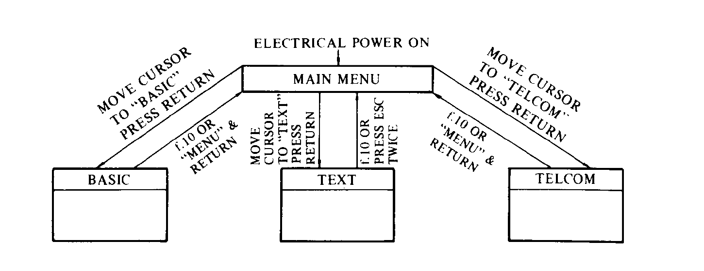
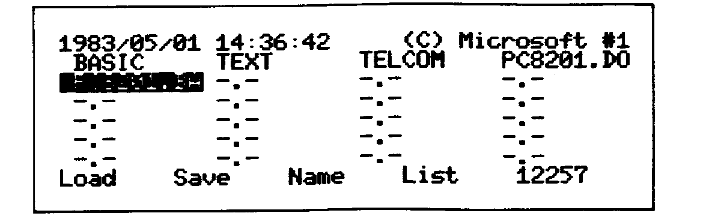
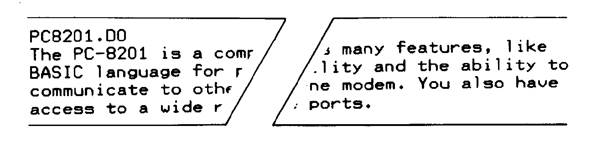
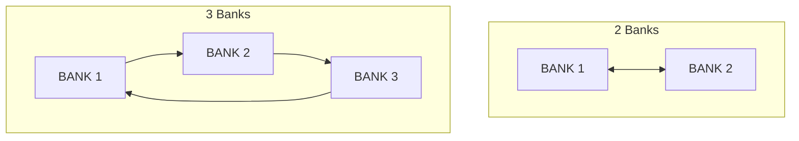

# Chapter 5: Operating the PC-8201

> Vision-OCR'd from NEC8201A-UsersGuide.pdf (image-only scan, source pages 53-98 / printed 5-1..5-46), 2026-05-30.
> Tier B vision review complete: illustrations cropped from the source scan, tables/ASCII/diagrams verified cell-by-cell against the page images.


## Menu Overview

The PC-8201 contains three software features, BASIC, TEXT, and TELCOM, whose files are handled by the MENU.

The use of files maintained by the MENU can be greatly expanded by writing customized programs.

> **REFERENCE:** Consult the BASIC Reference Manual for an explanation on how to write these programs.

The RAM in the PC-8201 can maintain multiple files of programs and texts. The arrangement of these files is performed by the MENU. This MENU provides the following functions:

- Change the name of a file
- Delete a file
- Copy a file
- Save a file on an external device
- Load a file from an external device
- Display file names
- Set or Clear IPL file
- Switching between available memory banks

## Selection of Features

As noted above, there are three primary software programs which are diplayed in the main MENU. The functions of each software feature are:

**BASIC** Used to create, modify, execute and customized BASIC programs.

**TEXT** Used to create and modify files, such as documents, memos, or any other type of text.

**TELCOM** Allows you to use the PC-8201 for multicomputer communication through a telephone modem with the RS-232C interface. The TELCOM feature, in conjunction with the RS-232C interface, also provides for communication between the PC-8201 and other peripheral devices.

When the PC-8201 is turned ON it is generally in the MENU mode. The selection of these features is done through the MENU:


<!-- source page 54 -->

When the power switch of the PC-8201 is turned ON the word BASIC will be displayed in reverse image on the second line of the screen. This reverse image is known as the cursor of the MENU.

This cursor is moved by using the four Cursor Movement Keys or the Space Bar. To use a feature or a customized program file stored in the PC-8201, the cursor is moved onto the appropriate name displayed on the screen. The selection is then made by pressing the [RETURN] key.

## Setting Time & Date

The real-time clock that is contained within the PC-8201 runs continuously through the use of internal NiCAD batteries, even when the power switch has been turned OFF.

The date and time are set by means of BASIC commands.

```text
1983/01/01 00:00:00      (C) Microsoft #1
BASIC         TEXT        TELCOM        -.-
-.-           -.-          -.-          -.-
-.-           -.-          -.-          -.-
-.-           -.-          -.-          -.-
-.-           -.-          -.-          -.-
Load    Save     Name     List      12374
```

The illustration above shows the screen display when the PC-8201 is turned ON. The word BASIC has a black background, in reverse image. Press the [RETURN] Key at this point and the screen should change to the display illustrated below. The PC-8201 is now in the BASIC mode:

```text
NEC PC-8201 BASIC Ver 1,0 (C) Microsoft
12374 Bytes free
Ok
|

Load "  Save "  Files   List    Run
```

To set the date:

Use the following BASIC command, substituting the date values for the letters YY, MM, and DD and then press the [RETURN] Key:

    date$="YY/MM/DD"

YY represents the numbers of the last two digits entered for the current year, MM for the current month, and DD for the current date. A zero must be entered in front of a single digit month, day, or year.

> **NOTE:** Be sure the double quotation marks are typed in the command as shown.

Some examples:

To show the date May 1, 1983, enter:

    date$="83/05/01"

For the date of December 24, 1982 enter:

    date$="82/12/24"

If an "Ok" message appears on the screen after you have made your entry you will know that you have performed the operation correctly:

```text
NEC PC-8201 BASIC Ver 1.0 (C) Microsoft
12374 Bytes free
Ok
date$="83/05/01"
Ok
|
Load "  Save "  Files   List    Run
```

If ?SN ERROR (Syntax Error) is displayed you have entered the command incorrectly. It may be a simple problem, such as omitting the double quotation marks. Check the format of the statement you have entered and repeat the process.

To set the time:

Use the following BASIC command, substituting the time values for HH, MM, and SS, and then press the [RETURN] Key:

    time$="HH:MM:SS"

In this case the HH represents the current hour, MM the minutes, and SS the seconds. When the correct hour, minute, or second is a single digit a 0 must precede it.

For example:

When the time is 2:07 PM and 30 seconds you would enter:

    time$="14:07:30"

If the time is 8:45 AM exactly, enter:

    time$="08:45:00"

The PC-8201 uses military time, which is a 24 hour clock:

```text
12374 Bttes free
Ok
date$="83/05/01"
Ok
time$="14:07:30"
Ok
|
Load "  Save "  Files   List    Run
```

<!-- "Bttes" is a misprint in the original scan (should read "Bytes"); transcribed faithfully — source page 57 -->

The "Ok" message should appear if you have entered the time command correctly.

The date and time should now be properly displayed on the first line of the screen when it is in the MENU mode.

> **REFERENCE:** Consult the BASIC Reference Manual for a description of the use of the BASIC commands used for setting the time and date.

## BASIC

To select the BASIC feature, position the cursor onto the word "BASIC" and then press the [RETURN] key.

When the PC-8201 is in the BASIC mode the screen display will change as illustrated:

```text
NEC PC-8201 BASIC Ver 1,0 (C) Microsoft
12374 Bytes free
Ok
|

Load "  Save "  Files   List    Run
```

Type in the following statements, which will create a simple program in BASIC:

    10 PRINT "The PC-8201 is a friendly computer!"
    20 PRINT "It offers many features, including the
              ... generation of sound,";
    30 PRINT "  wordprocessing and ... many more."

> **NOTE:** Press the [RETURN] Key at the end of each statement. Some of the lines above will not fit onto one line of the PC-8201 screen, so they will appear differently than those shown above. Blank spaces inserted in the program lines above are indicated by (_).

To give the program a name and to save it in the RAM type:

    Save "PC8201" [RETURN]

> **NOTE:** Be careful to leave one space after the word "Save" and make sure you put double quotation marks around the file name. If you type this command incorrectly an error message will be displayed.

Now return to the MENU mode by pressing the f.10 Function Key. (The f.10 Function Key is utilized by pressing the [SHIFT] Key and the f.5 Function Key simultaneously.):

```text
1983/01/01 00:00:00      (C) Microsoft #1
BASIC         TEXT        TELCOM        PC8201.BA
-.-           -.-          -.-          -.-
-.-           -.-          -.-          -.-
-.-           -.-          -.-          -.-
-.-           -.-          -.-          -.-
Load    Save     Name     List      12374
```

Notice that your file PC8201.BA has been saved and its name is displayed on the screen.

Now move the cursor onto the file name "PC8201" and then press the [RETURN] Key. This will run your program and your screen should look like this:

```text
The PC-8201 is a friendly computer!
It offers many features, including the
generation of sound, wordprocessing
and many more.
Ok

Load "  Save "  Files   List    Run
```

## TEXT

To select the TEXT feature, move the cursor onto the word "TEXT" and then press the [RETURN] Key.

When the PC-8201 is in the TEXT mode the screen display will appear as illustrated:

```text
File to edit? |
```

Type in the file name "PC8201" and then press [RETURN]. Your screen will now appear as follows:

```text
File to edit? PC8201|
```

The screen is ready for input. Type in

```text
The PC-8201 is a compact and smart
computer. It offers many features, like
BASIC language for programming, word
processing capability and the ability to
 communicate to other machines by the
use of a telephone modem. You also have
access to a wide range of devices thru
its interface ports.
```

To save the text file you have just created simply press the f.10 Function Key to return to the MENU. Your file will be saved automatically through this process.

Notice that the file name will appear on the MENU screen as shown:

```text
1983/01/01 00:00:00      (C) Microsoft #1
BASIC         TEXT        TELCOM        PC8201.DO
PC8201.BA     -.-          -.-          -.-
-.-           -.-          -.-          -.-
-.-           -.-          -.-          -.-
-.-           -.-          -.-          -.-
Load    Save     Name     List      12374
```

## TELCOM

To select the TELCOM feature move the cursor onto the word "TELCOM" and then press the [RETURN] Key.

When the PC-8201 is in the TELCOM mode the screen display will appear as illustrated:

```text
8I71XS
Telecom: |

                              Stat    Term
```

<!-- "8I71XS" verified against scan (chars 8-I-7-1-X-S); it is the TELCOM status/format string shown verbatim — source page 62 -->

> **REFERENCE:** See Chapter 8 for further explanations of this feature.

Return to the MENU by pressing the f.10 Function Key.

## Files

When you have returned to the MENU, notice that the files PC8201.BA and PC8201.DO have been added to the display:

```text
1983/01/01 00:00:00      (C) Microsoft #1
BASIC         TEXT        TELCOM        PC8201.DO
PC8201.BA     -.-          -.-          -.-
-.-           -.-          -.-          -.-
-.-           -.-          -.-          -.-
-.-           -.-          -.-          -.-
Load    Save     Name     List      12374
```

The addition of these file names on the display indicates that they have been saved in the RAM.

A file can be saved in the RAM of the PC-8201 from the MENU, BASIC or TEXT modes. A file contained within the RAM will not be erased when the power switch is turned OFF, but will be saved in its original condition.

A file name consists of three parts:

- The main name, which must be no more than 6 characters in length.

- A period, used as a connector in the middle of the file name.

- The file type extension, added to the end of the file name, which is 2 characters long.

The file name can consist of any combination of characters, however the use of letters instead of numbers or symbols is recommended. You run the risk of getting the error message "?NM Error" (Name Error) when using characters other than ordinary letters. A legal file name must be entered if this message is displayed.

<!-- p-064: blank verso — no content -->

The maximum number of files that can be stored in each of the three
memory banks is 21, depending on the size of the individual
files.  If an attempt is made to store more than the maximum
allowable in a bank, an error will occur.  The message "?FL Error"
(File Limit) will be displayed if you are in the BASIC mode.  A
"BEEP" sound will be generated indicating and error when in the
TEXT mode, and the message "?Download Aborted" will be
displayed if you are in the TELCOM mode.

The files are displayed on the screen in the following order:

    Machine Language files

    TEXT files

    BASIC files

The contents of a text file can be examined directly from the
MENU.  It is also possible to execute BASIC programs and Machine
Language programs in the same manner.

**EXAMPLE:**

Move the cursor onto the word "PC8201.BA" and then press the [RETURN]
Key.  The PC-8201 is now in the BASIC mode and the previously
created BASIC program "PC8201.BA" will be run.  The screen will
appear as shown:

```text
The PC-8201 is a friendly computer!
It offers many features, including the
generation of sound, wordprocessing
and many more.
Ok

Load "  Save "  Files    List    Run
```

Return to the MENU by pressing the f.10 Function Key.

## Commands

There are eight commands accessible from the MENU.  They are
executed by pressing the corresponding Function Key.  In most
cases, a message will appear on the bottom line of the screen
requesting a file name or other data to be entered when a command
is utilized.

> **NOTE:** For f.6 through f.10 Function Keys, use the [SHIFT] Key
> and the Function Keys simultaneously.

> **REFERENCE:** There are commands available in the **TEXT** and **TELCOM**
> modes not described here.  See Chapter 7 for **TEXT**
> commands and Chapter 8 for **TELCOM** commands.

### COMMAND DESCRIPTIONS

### f.1/LOAD

FUNCTION

Loads a file from a specific external device and saves it in RAM.

DESCRIPTION

To use LOAD:

1. Press the f.1 Function Key.

2. When the following message appears, indicate which file is to be
   loaded and specify from which external device it is being
   loaded from:

       Load from (file name)

3. When the "Save as" message appears, then indicate the name of
   the file that is to be saved in RAM:

       Save as (file name)

> **REFERENCE:** When you input these file names make sure you follow the
> naming conventions described in the section on files in
> this chapter.

4.a)  If you have indicated a file name that is new (different from
      the names of any files presently stored in the RAM), the fol-
      lowing message will be displayed:

          Ready?

      The loading process will begin after the "Y" has been input.

   b)  If you have indicated a file name that is identical to another
       file name presently stored in the RAM, the following
       message will be displayed:

           Sure?

       If you type in "Y", the PC-8201 will begin to load and the
       contents of the original file will be erased.

If you do not want to erase the contens of the original file input any
key except the "Y".  The load command will then be cancelled,
preserving the contents of the original file.

LOAD command designates the specific device and file:

    (external device name):(file name)

The name of the external device can be designated:

    CAS:Cassette tape

    COM:RS-232C

> **NOTE:** If the name of the external device is omitted, it will
> default to "CAS:".

The file name can be designated when an external device "CAS:" is
used.  When using "CAS:" and the file name is omitted, the first
file read from the cassette tape will be loaded.

When external device name "COM:" is used, specify the communica-
tion format instead of a file name.  If the format is omitted, the
communication will be performed in the current status (the first
value indicated when TELCOM is selected).

The responses used for the load process, external device name, and
the resulting file name are listed:

| Response to "Load from" | External Device | Resulting File Name |
|---|---|---|
| (no response entered) | Cassette recorder | (no file name resulting) |
| TEST | Cassette recorder | TEST |
| CAS: TEST | Cassette recorder | TEST |
| COM | RS-232C | (current mode) |
| COM: 8I71XN | RS-232C | (8I71XN) |

The file type must be attached to the file name in response to a
"Save as" prompt.  The system checks the file type and the
following is performed:

1. When the external device has been designated as "COM:", the
   file type must be ".DO" (text file).

2. If the file type is ".BA", the BASIC file in binary format is
   loaded.

3. If the file type is ".DO", the text or BASIC file in ASCII
   format is loaded.

4. If the file type is ".CO", a machine language file is loaded.

When the specified file name already exists, the contents of the
original file are erased if "Y" is input after the "Sure?" message.

If "Y" is input in response to the "Ready?" message or the "Sure?"
message, the PC-8201 will begin the search for a compatible file in
the designated input/output device.

When the PC-8201 begins to search for a file that is on a cassette
tape, one of the following messages will appear at the bottom of the
screen when it locates a file:

    Skip: (name of file)

This means that it will skip this file and continue searching.  When
it does locate the correct file name, it will display:

    Found (name of file)

and load the file.  If the file is loaded without difficulty, the MENU
display will appear on the screen.

> **NOTE:** If you want to interrupt the loading process, please press
> the [SHIFT] Key and the [STOP] Key simultaneously.

When the maximum number of 21 files are present in the RAM, any
designation of additional file names through the "Save as" prompt
will result in an error.  This will also happen if the memory is filled
up during the loading process.  The best thing to do when this
happens is to create extra space by erasing any unwanted file using
the KILL command and then begin the loading process once again.

**EXAMPLE:**

1. Load a text file from cassette tape and save as a newly
   designated file named "PC8201.DO".  Press the f.1 Function
   Key first.  The prompt "Load from" will appear on the
   bottom line of the screen.  Input "CAS:TEST" or "TEST" in
   response to the prompt:

```text
1983/05/01 14:22:13      (C) Microsoft #1
BASIC        TEXT        TELCOM      PC8201.DO
PC8201.BA  -.-         -.-         -.-
-.-        -.-         -.-         -.-
-.-        -.-         -.-         -.-
-.-        -.-         -.-         -.-
Load from TEST_
```

   "Save as" will be displayed in place of the previous prompt:

```text
1983/05/01 14:28:43      (C) Microsoft #1
BASIC        TEXT        TELCOM      PC8201.DO
PC8201.BA  -.-         -.-         -.-
-.-        -.-         -.-         -.-
-.-        -.-         -.-         -.-
-.-        -.-         -.-         -.-
Save as _
```

   "Ready?" will be displayed if you input the [RETURN] Key.  Check
   to see that the cassette recorder is properly connected and the
   tape is set up for use.  Input "Y" and the [RETURN] Key and the
   PC-8201 will then begin searching for the text file TEST on the
   cassette tape:

```text
1983/05/01 14:29:04      (C) Microsoft #1
BASIC        TEXT        TELCOM      PC8201.DO
PC8201.BA  -.-         -.-         -.-
-.-        -.-         -.-         -.-
-.-        -.-         -.-         -.-
-.-        -.-         -.-         -.-
Save as PC8201.DO  Ready? Y
```

   The PC-8201 will load the file when it has located it on the cassette
   tape and will create a file entitled "PC8201.DO".  This file will be
   saved in the RAM of the PC-8201.  The screen will then return to
   the regular MENU display.

### f.2/SAVE

FUNCTION

Saves a file from the RAM into a specified input/output device.

DESCRIPTION

To use the SAVE command:

1. Move the cursor onto the file name to be saved and then press
   the f.2 Function Key.

2. Designate the external device on which the file is to be saved,
   in response to the following prompt:

       Save (file name) as

3. When you are designating a BASIC file to be saved on any
   external device other than the RS-232C, the PC-8201 will ask
   what storage format is to be used:

       B(inary) or A(scii)?

   Type "B" if the file is to be stored in binary format and "A"
   when it is to be saved in ASCII format.  Press the [RETURN] Key
   alone to default to binary format.

4. A prompt for confirmation is then displayed:

       Ready?

   If you respond with "Y" or with the [RETURN] Key, the save process
   will start.  When saving is successfully completed the screen
   will display the MENU.

When "Save (file name) as" is displayed:

    (name of external device):(file name)

must be input.  The possible external devices to be entered on the
left side of the colon:

    CAS:    Cassette tape

    COM:    RS-232C

The name of the external device can be designated by the
abbreviation "CAS:".

The name of a file is designated after an external device "CAS:" is
input.  If the name of a file is omitted it will be stored in the RAM
under an identical file name.

EXAMPLE:    CAS:SAMPLE

When the name of the external device is "COM:", this designates a
data transmission format instead of a file name.  If the data
transmission format is omitted, the current mode is retained.

A text file ".DO" and a BASIC file ".BA" can be saved to any
external device, but a machine language file cannot be saved through
the use of the RS-232C interface.

If a BASIC program is saved in binary format, the time required to
save it will be very short, and it can be stored using minimal storage
space.  A saved program can then be loaded into the PC-8201 at
any time.  If a program is saved in the ASCII format, it is possible
to merge files using a BASIC command.  In addition, after loading
has been conducted using the LOAD command, various types of
editing can be performed in the TEXT mode.

The save process will begin immediately after the final confirmation
"READY?" is responded to by typing "Y" or pressing the [RETURN]
Key.  The screen will return to the normal MENU display when the
save process is completed.

> **NOTE:** Press the [SHIFT] Key and the [STOP] Key simultaneously to
> interrupt and stop the save process.

The following chart consists of the appropriate response to use with a
prompt, the results of the response, type of external device, and the
resulting file name:

| File Name Selected | Response to "Save (name of file) as" | External Device | Resulting file name |
|---|---|---|---|
| NOTE.DO | (no response entered) | Cassette recorder | NOTE |
| NOTE.DO | MEMO | Cassette recorder | MEMO |
| NOTE.DO | CAS: MEMO | Cassette recorder | MEMO |
| NOTE.DO | CAS: | Cassette recorder | NOTE |
| NOTE.DO | COM: 8171XN | RX-232C [sic] | (8171XN) |
| NOTE.DO | COM: | RS-232C | (Current mode) |
| MAZE.BA | (no response entered) | Cassette recorder | MAZE |
| MAZE.BA | DEMO | Cassette recorder | DEMO |
| MAZE.BA | CAS: DEMO | Cassette recorder | DEMO |
| MAZE.BA | COM: 8171XS | RS-232C | (8171SX) [sic] |
| MAZE.BA | COM: | RS-232C | (current mode) |
| TEST.CO | (no response entered) | Cassette recorder | TEST |
| TEST.CO | Test 1 | Cassette recorder | TEST 1 |
| TEST.CO | CAS: TEST 1 | Cassette recorder | TEST 1 |

<!-- source page 75; verified cell-by-cell. "RX-232C" (NOTE.DO/COM:8171XN row) is a source misprint for RS-232C, transcribed faithfully. Result "(8171SX)" for the COM:8171XS input is also as printed (X/S transposed in the source) -->
<!-- source page 75 -->

**EXAMPLES:**

1. To save the text file "PC8201.DO" on cassette tape under the
   name of "TEST":

   In the MENU mode, move the cursor onto "PC8201.DO" and
   press the f.2 Function Key:

```text
1983/05/01 14:35:57      (C) Microsoft #1
BASIC        TEXT        TELCOM      PC8201.DO
PC8201.BA  -.-         -.-         -.-
-.-        -.-         -.-         -.-
-.-        -.-         -.-         -.-
-.-        -.-         -.-         -.-
Load    Save    Name    List    12257
```

   The bottom line of the screen will display a message requesting
   the name of the external device, as well as the name of the file:

```text
1983/05/01 14:36:21      (C) Microsoft #1
BASIC        TEXT        TELCOM      PC8201.DO
PC8201.BA  -.-         -.-         -.-
-.-        -.-         -.-         -.-
-.-        -.-         -.-         -.-
-.-        -.-         -.-         -.-
Save PC8201.DO as _
```

   Type in the file name "TEST" and press the [RETURN] Key.

The prompt "Ready?" will be displayed on the same line as the previous prompt:

```text
1983/05/01 14:36:28      (C) Microsoft #1
 BASIC       TEXT       TELCOM    [PC8201.DO]
 PC8201.BA  -.–         -.–        -.–
  -.–        -.–         -.–        -.–
  -.–        -.–         -.–        -.–
  -.–        -.–         -.–        -.–
Save PC8201.DO as Ready? _
```

Type "Y" once the cassette recorder has been properly connected to the PC-8201 and the tape set up for use. The screen will return to the regular MENU display:

```text
1983/01/01 00:00:00      (C) Microsoft #1
[BASIC]     TEXT       TELCOM    PC8201.DO
 PC8201.BA  -.–         -.–        -.–
  -.–        -.–         -.–        -.–
  -.–        -.–         -.–        -.–
  -.–        -.–         -.–        -.–
Load       Save       Name       List       12374
```

The file has now been correctly saved on cassette tape.

2. To save the BASIC file "PC8201.BA" with a new name of "FILE" (this file is in ASCII format):

   Move the cursor onto "PC8201.BA" and press the f.2 Function Key:

```text
1983/05/01 14:36:42      (C) Microsoft #1
 BASIC       TEXT       TELCOM    PC8201.DO
[PC8201.BA] -.–         -.–        -.–
  -.–        -.–         -.–        -.–
  -.–        -.–         -.–        -.–
  -.–        -.–         -.–        -.–
Load       Save       Name       List       12257
```


<!-- source page 77 -->

The message will appear on the last line of the screen the same as it did in the previous example:

```text
1983/05/01 14:37:31      (C) Microsoft #1
 BASIC       TEXT       TELCOM    PC8201.DO
[PC8201.BA] -.–         -.–        -.–
  -.–        -.–         -.–        -.–
  -.–        -.–         -.–        -.–
  -.–        -.–         -.–        -.–
Save PC8201.BA as _
```

Input "FILE" or "CAS:FILE" in response to the message:

```text
1983/05/01 14:37:31      (C) Microsoft #1
 BASIC       TEXT       TELCOM    PC8201.DO
[PC8201.BA] -.–         -.–        -.–
  -.–        -.–         -.–        -.–
  -.–        -.–         -.–        -.–
  -.–        -.–         -.–        -.–
Save PC8201.BA as CAS:FILE_
```

The PC-8201 will now ask if the file is to be saved in ASCII format or Binary format:

```text
1983/05/01 14:38:26      (C) Microsoft #1
 BASIC       TEXT       TELCOM    PC8201.DO
[PC8201.BA] -.–         -.–        -.–
  -.–        -.–         -.–        -.–
  -.–        -.–         -.–        -.–
  -.–        -.–         -.–        -.–
B(inary) or A(scii)? _
```

Input "A" since this file is in ASCII format. "Ready?" will be displayed for confirmation. The file will be saved when you input the [RETURN] Key. The screen will again return to the MENU display.

## f.3/NAME

FUNCTION

Change the file name.

DESCRIPTION

To use the NAME command:

1. Move the cursor onto the name of the file to be renamed and then press the f.3 Function Key.

2. Enter the new file name in response to the following prompt, where "xxxxxx.xx" in this case is the file name to be changed:

   NAME xxxxxx.xx as

3. Type in a proper file name, press the [RETURN] Key, and the old name of the file will be changed to the new name. The new name will be displayed on the screen in place of the old name.

It is impossible to assign a file type such as ".DO", ".BA", or ".CO" when you are replacing an old file name with a new name. The new file will automatically assume the same file type extension as the old file.

A "BEEP" sound will be generated and the input will be rejected if one of the following has been entered:

1. If an attempt is made to designate a file name that is longer than 6 characters.

2. If you try to include a period or colon as part of the 6 character name.

3. If you assign an already existing name to a new file.

Most punctuation marks, other than the colon or period, may be used as part of a file name.

The PC-8201 will accept an identical file name for a new file if one file name is entered in upper case letters and the other in lower case letters.

If it becomes necessary to cancel a process while executing a file NAME command, you may perform one of the following procedures:

1. Press the [STOP] Key.

2. Press the [CTRL] Key + the C Key.

3. Press the [RETURN] Key if the name you are assigning has not yet been input into the PC-8201.

## f.4/LIST

FUNCTION

LIST outputs the contents of a file to the printer.

DESCRIPTION

To use the LIST command:

1. Move the cursor onto the name of the file to be printed and then press the f.4 Function Key.

2. The following prompt will be displayed:

   List width (nn) :

   "nn" is the default value and new line width may be entered at this time.

3. The final preparatory step consists of the PC-8201 displaying a question about user approval to continue to the next step.

   List (name of file) Ready?

   Type "Y" if the printer is properly connected to the PC-8201 and it is turned ON and the SEL (select) button has been pressed.

The cursor may be used to designate a file to be printed if the file is either a BASIC ".BA" or TEXT ".DO" file. If any other file is designated a "beep" sound will be generated and the input will be rejected.

The line width allowable for a text file must be greater than 9 but less than 133. The default value of the line width is displayed within parentheses. You may press the [RETURN] Key to use the default value displayed or input another value within the allowable limits. After designating another value, that value will automatically become the default value.

When the final confirmation message is displayed please verify the following items:

1. That the PC-8201 and the printer are correctly connected.

2. That the printer is turned ON and selected (SEL) pressed.

Once you are sure that the printer is ready, then type in "Y" or press the [RETURN] Key. The printer will automatically begin printing the contents of the file.

If the printer is not properly connected to the PC-8201 or if the printing stops midway, then press any key.

The printing process will begin as soon as the connections between the printer and the PC-8201 are corrected.

When a malfunction does occur, or if you want to interrupt the printing, just press the [SHIFT] Key and the [STOP] Key simultaneously.

The LIST function has the following features when a file is being printed:

1. Automatic word-wrap feature

2. Dropping the lead spaces (dropping extra spaces at the beginning of lines)

The automatic word-wrap feature moves a word onto the next line when the word is going to extend past the margin setting.

> **REFERENCE:** Refer to Chapter 7 TEXT for a detailed explanation of this function.

The feature for dropping lead spaces disregards any unnecessary spaces at the beginning of a new line. In other words, if the first column of a line would be a space, then the space will be deleted and the line shifted to the left to fill in that space. However, if the line ends with a return code, the line will be printed as typed and no spaces dropped. (This would allow the beginning of a paragraph to be indented without the lead spaces being dropped.)

> **NOTE:**
> Please be aware of the following for a printed text file:
>
> **1. The return code "**[RETURN]**" is not printed.**
>
> **2. The indentation remains as typed into the PC-8201 if the line ends with a return code.**

**EXAMPLE:**

1. Print the text file "PC8201.DO" with the printer. While in the MENU mode, move the cursor onto the file name and press the f.4 Function Key:

```text
1983/05/01 14:35:57      (C) Microsoft #1
 BASIC       TEXT       TELCOM   [PC8201.DO]
 PC8201.BA  -.–         -.–        -.–
  -.–        -.–         -.–        -.–
  -.–        -.–         -.–        -.–
  -.–        -.–         -.–        -.–
Load       Save       Name       List       12257
```

   The prompt requesting you to specify line width will appear. Input the number 40:

```text
1983/05/01 14:51:39      (C) Microsoft #1
 BASIC       TEXT       TELCOM   [PC8201.DO]
 PC8201.BA  -.–         -.–        -.–
  –.–        -.–         -.–        -.–
  -.–        -.–         -.–        -.–
  -.–        -.–         -.–        -.–
List Width(40): 40_
```

   Press the [RETURN] Key. The prompt "Ready?" will appear. Be sure the printer is connected to the PC-8201 properly and it is "selected" (SEL button is depressed). Then input "Y" or the [RETURN] key:

```text
1983/05/01 14:51:56      (C) Microsoft #1
 BASIC       TEXT       TELCOM   [PC8201.DO]
 PC8201.BA  -.–         -.–        -.–
  -.–        -.–         -.–        -.–
  -.–        -.–         -.–        -.–
  -.–        -.–         -.–        -.–
List PC8201.DO Ready? Y
```

   The file should then be printed as "hard copy" from the printer:

```text
PC8201.DO
The PC-8201 is a compact and smart
computer. It offers many features, like
BASIC language for programming, word
processing capability and the ability to
communicate to other machines by the use
of a telephone modem. You also have
access to a wide range of devices thru
its interface ports.
```

   There should be no difference from the file on the LCD display and the file printed on paper, except that the line feed symbols will remain on the display but will not be printed. The sixth line should be shifted one column, to the left, showing that the lead space has been properly dropped.

   The lead space in the fourth line is not dropped because the previous line ended with a return code. The return code should not print out.

2. Print the file with a line width of 80. Input 80 when the prompt requests List width.

   Print the file the same as was done in the first example.

   The indentation and automatic word wrap functions will operate with the 80 column line. For this reason the printed file will look very different from the file on the screen:


<!-- source page 85 -->

3. Print the BASIC file "PC8201.BA". Move the cursor onto the file name while in the MENU mode and then press the f.4 Function Key.

   No prompts will appear on the screen except the "Ready?" prompt. Be sure your printer is connected and selected:

```text
1983/05/01 15:04:31      (C) Microsoft #1
 BASIC       TEXT       TELCOM    PC8201.DO
[PC8201.BA] -.–         -.–        -.–
  -.–        -.–         -.–        -.–
  -.–        -.–         -.–        -.–
  -.–        -.–         -.–        -.–
List PC8201.BA Ready? Y
```

   Input "Y" in response to the prompt or press the [RETURN] Key. The printed file looks like this:

```text
PC8201.BA
10 PRINT ' The PC-8201 is a friendly
   computer!'
20 PRINT ' It offers many features,
   including the generation of sound,';
30 PRINT ' wordprocessing and many more.'
```

## f.6/SETIPL

FUNCTION

The SETIPL command will set a predetermined group of instructions previously saved in a file, so when the PC-8201 is turned ON, those instructions are executed.

DESCRIPTION

An IPL Command File is a series of commands or information that you would normally input from the keyboard.

The purpose for using an IPL file would be to save time or steps when you have a repeated series of operations that you want to be executed, each time the PC-8201 is turned ON. An IPL file can also protect your PC-8201 from unauthorized use by requiring the input of a password prior to use.

To use the SETIPL command:

1. Move the cursor onto the name of the file to be set as an IPL Command file.

2. Press the f.6 Function Key ([SHIFT] + f.1).

3. Turn OFF the power switch of the PC-8201.

4. Turn the power ON again and the designated IPL Command file will be executed.

Only a TEXT file ".DO" can be designated as an IPL Command file. After the SETIPL command has been used, the IPL Command file is displayed with "•DO" attached to the IPL file name when it appears on the main MENU.

An IPL file can execute commands, or respond to commands with designated information. The three main commands that an IPL Command file can execute as the first command are BASIC, TEXT, and TELCOM.

Once any of these modes has been entered by using an IPL Command file, commands specific to those modes can be executed.

If an error occurs during the execution of these commands, then the IPL file will interrupt its operation and display a message appropriate to the error. The lines following the command causing the error will not be executed.

If an invalid file name is designated as an IPL file, a "BEEP" sound is generated when the power switch is turned ON, and the IPL process will not work.

If an IPL Command file already exists and another file has been designated as an IPL Command file, the original IPL Command file "•DO" will revert to an ordinary text ".DO" file, allowing the newly designated file to become the IPL Command file. The IPL Command file will also return to its original form when the CLRIPL (Clear IPL) command is used.

A SAMPLE OF AN IPL Command File:

The PC-8201 can be used for note taking during meetings, which is done in the TEXT Mode. An IPL command file can be designated to perform the steps of entering the mode and the file, each time a meeting is attended.

Select the MENU mode, move the cursor onto "TEXT" and then press the [RETURN] key. Type "IPL.DO" for the file name, in response to the prompt "File to edit?", and then press the [RETURN] Key. Then type the following lines while in the TEXT mode:

```text
TEXT
MEMO.DO
```

Notice the symbol (carriage return) is displayed each time the [RETURN] Key is input in the TEXT Mode. In the above example, the command line "TEXT" instructs the PC-8201 to automatically enter the TEXT mode when the power is turned ON. The command line "MEMO.DO" answers the prompt "File to edit?" in the TEXT Mode and the contents of the MEMO.DO file is displayed on the screen.

When typing IPL commands or information that the IPL feature will use, the [RETURN] is used to separate the commands. This Return character tells the SETIPL command to ignore the spaces following the commands, in order to save memory space.

Up to a maximum of 64 characters (letters and numbers) can be contained within an IPL Command File. However, the [RETURN] is calculated as 2 letters (carriage return and line feed).

## ANOTHER SAMPLE OF AN IPL FILE:

To create a file that requires the use of a password before accessing the PC-8201:

Select the MENU Mode, move the cursor onto "TEXT" and then press the [RETURN] Key. Type "PASSWD.DO" for the file name, in response to the prompt "File to edit?", and then press the [RETURN] Key. Then type the following lines while in the TEXT Mode:

```text
BASIC
CLS:INPUT A$:IF A$<  >"PC-8201" THEN POWER OFF
ELSE MENU
```

Now press the f.10 Function Key ([SHIFT] and f.5). This file will be saved in the RAM as the name "PASSWD.DO".

Now move the cursor onto the newly created file name "PASSWD.DO" and press the f.6 Function Key ([SHIFT] and f.1). The file is now a designated IPL Command file and will be displayed on the MENU screen as "PASSWD•DO".

Turn the power switch of the PC-8201 OFF and then ON again. Type in "PC-8201" in response to the question mark, but do not type in the quotation marks. Press the [RETURN] Key after your entry. The PC-8201 shifts into the MENU Mode and is ready for use.

Turn the PC-8201 OFF and then ON again, and type in "PC-8201" in lower case letters. After you press the [RETURN] Key the PC-8201 will shut itself OFF because the correct password was not entered. Therefore, only authorized persons that know the correct password can access the PC-8201.

The password can be changed as frequently as desired, but remember it or keep a note for yourself as to what word has been designated. Also, the password can be increased in length to avoid any guessing from unauthorized persons.

## f.7/CLRIPL

### FUNCTION

Reset an IPL Command File.

### DESCRIPTION

To use the CLRIPL command:

Press the f.7 Function Key. ([SHIFT] + f.2)

When the f.7 Function Key is pressed, and IPL Command File "•DO" will revert itself to an ordinary text file ".DO", regardless of the location of the cursor:

<!-- source page 91 -->

```text
1983/01/10 00:00:37      (C) Microsoft #1
[BASIC   ]  TEXT         TELCOM   PASSWD*DO
  -.-       -.-            -.-      -.-
  -.-       -.-            -.-      -.-
  -.-       -.-            -.-      -.-
  -.-       -.-            -.-
SetIPL  ClrIPL           Kill    Bank
```

### EXAMPLE:

Press the f.7 Function Key and the file name will revert to an ordinary file:

<!-- source page 91 -->

```text
1983/01/10 00:00:37      (C) Microsoft #1
[BASIC  ]   TEXT         TELCOM   PASSWD.DO
  -.-       -.-            -.-      -.-
  -.-       -.-            -.-      -.-
  -.-       -.-            -.-
SetIPL  ClrIPL           Kill    Bank
```

## f.9/KILL

### FUNCTION

Delete a file stored in the RAM.

### DESCRIPTION

To use the KILL command:

1. Move the cursor onto the name of the file to be erased and then press the f.9 Function Key ([SHIFT] + f.4).

2. The following prompt will appear for confirmation, where "xxxxxx.xx" represents the name of the file to be deleted:

   KILL xxxxxx.xx SURE?

3. Enter a "Y" and the file will be deleted. (Use of the [RETURN] Key is not required in this procedure.)

Any file that contains ".BA", ".DO", or ".CO" as the file type can be the object of a KILL command. If a "Y" has been input correctly after the prompted message appears, the selected file will be erased from the RAM. The file name will then be eradicated from the MENU.

To cancel the execution of the KILL command, input any key other than a "Y".

### EXAMPLE:

To eliminate the "PC8201.DO" file, move the cursor onto the file name and press the f.9 Function Key:

<!-- source page 93 -->

```text
1983/05/01 15:38:44      (C) Microsoft #1
BASIC       TEXT         TELCOM   [PC8201.DO]
PC8201.BA  -.-            -.-      -.-
  -.-       -.-            -.-      -.-
  -.-       -.-            -.-      -.-
  -.-       -.-            -.-      -.-
SetIPL  ClrIPL           Kill    Bank
```

A prompt requesting confirmation will appear on the last line of the screen. Input "Y":

<!-- source page 93 -->

```text
1983/05/01 15:38:07      (C) Microsoft #1
BASIC       TEXT         TELCOM   [PC8201.DO]
PC8201.BA  -.-            -.-
  -.-       -.-            -.-      -.-
  -.-       -.-            -.-      -.-
  -.-       -.-            -.-      -.-
Kill PC8201.DO Sure? Y
```

The file is no longer displayed on the screen and it is erased from the RAM of the PC-8201:

<!-- source page 93 -->

```text
1983/05/02 19:43:02      (C) Microsoft #1
BASIC     [TEXT  ]       TELCOM   PC8201.DO
PC8201.BA  -.-            -.-      -.-
  -.-       -.-            -.-      -.-
  -.-       -.-            -.-      -.-
  -.-       -.-            -.-      -.-
Load    Save     Name    List    12374
```

<!-- source page 93: verified. After the KILL the highlight has moved to TEXT and PC8201.DO still appears in the right-hand column exactly as printed in the source scan. -->

## f.10/BANK

### FUNCTION

Switch from one bank to another bank. (Possible only while in the MENU mode.)

### DESCRIPTION

To use the BANK command:

Press the f.10 Function Key ([SHIFT] + f.5).

When the RAM is expanded to more than one bank, the existing bank number can be changed on the MENU screen by pressing the f.10 Function Key.

The switching occurs in the sequence illustrated, depending on the number of banks contained in the RAM:


<!-- source page 94: 2-bank toggles BANK 1 <-> BANK 2; 3-bank cycles BANK 1 -> BANK 2 -> BANK 3 -> BANK 1 (verified against scan) -->

The number displayed on the screen will always remain "1" if the memory has not been expanded to utilize Banks #2 and #3.

The current bank number is displayed in the upper right corner of the screen in this format:

#n  (n = bank number in use)

### EXAMPLE:

If the memory of the PC-8201 has been expanded you may check the presence of the three available banks. Bank #1, with the file names stored in that bank displayed, is shown below:

<!-- source page 95 -->

```text
1983/01/01 00:00:00      (C) Microsoft #1
[BASIC  ]   TEXT         TELCOM   PC8201.BA
  -.-       -.-            -.-      -.-
  -.-       -.-            -.-      -.-
  -.-       -.-            -.-      -.-
  -.-       -.-            -.-
Load    Save     Name    List    12374
```

Press the f.10 Function Key to display Bank #2, with the files contained in it, on the screen:

<!-- source page 95 -->

```text
1983/01/01 00:00:00      (C) Microsoft #1
[BASIC  ]   TEXT         TELCOM   PC8201.DO
PC8201.BA  -.-            -.-      -.-
  -.-       -.-            -.-      -.-
  -.-       -.-            -.-      -.-
  -.-       -.-            -.-      -.-
Load    Save     Name    List    12374
```

The same is done to display Bank #3, once again pressing the f.10 Function Key:

<!-- source page 95 -->

```text
1983/01/01 00:00:00      (C) Microsoft #1
[BASIC  ]   TEXT         TELCOM   -.-
  -.-       -.-            -.-      -.-
  -.-       -.-            -.-      -.-
  -.-       -.-            -.-      -.-
  -.-       -.-            -.-      -.-
Load    Save     Name    List    12374
```

## Load (READ) from & Record (SAVE) to a Cassette Tape

By utilizing the cassette recorder with the PC-8201, the operation of loading and recording can be performed in two different methods. One method uses the Function Keys while in the MENU mode, and the other method uses commands in the BASIC mode.

### Loading (Read Out) from a cassette recorder to the PC-8201:

When reading programs or text files to the PC-8201, the LOAD process is performed. Please be sure all cables have been connected to the PC-8201 and Data Recorder correctly.

> **REFERENCE:** See Chapter 4 for details on installation of the recorder.

While in the BASIC mode, you should type in the command "CLOAD" followed by the name of the desired file and then press the [RETURN] Key:

```text
CLOAD "DEMO"
```

> **NOTE:** Be sure you have a space between CLOAD and the file name and that you include double quotation marks around the file name.
>
> If you do not type in a name, the first file available will be loaded.

If in the MENU mode, press the f.1 Function Key and then type in the file name. The file name selected would be one of the previously saved files displayed on the screen.

> **REFERENCE:** See the Commands section of Chapter 5 for information on loading from the MENU mode.

For both methods, when the PC-8201 has been connected, the tape will start rotating as soon as the PC-8201 has been activated for loading. While the PC-8201 is engaged in the loading process, it will appear to have stopped operation completely. Operation of the PC-8201 will resume normally once the loading is completed.

> **NOTE:** If interruption of the loading is necessary, just press the [SHIFT] Key and the [STOP] Key at the same time to stop the recorder. Pressing the [STOP] Key alone will not stop the operation of the recorder.

### Recording (Save) to a cassette tape from the PC-8201:

When a BASIC program or text file from the PC-8201 is to be recorded on a cassette tape, the process is known as SAVE. Please be sure all cables to the PC-8201 and Data Recorder have been connected correctly.

> **REFERENCE:** See Chapter 4 for details on installation of the recorder.

Forward the tape far enough to insure that the magnetic portion of the tape is in position, and that the blank leader portion of the tape will not be used.

Press both the Load (Play) and Save (Record) buttons at the same time to write onto the cassette tape. The recorder will not be activated until the following operation has been performed:

While in the BASIC mode, type in the command "CSAVE" followed by the name of the desired file and then press the [RETURN] Key:

```text
CSAVE "DEMO"
```

If in the MENU mode, press the f.2 Function Key and then type in the previously saved file name displayed on the screen.

> **REFERENCE:** See the Commands section of Chapter 5 for details on saving while in the MENU mode.

The cassette tape should then begin to rotate and sound signals will be transmitted to the recorder. Once again, the PC-8201 will appear to have stopped operation during the SAVE process. When the recording of the cassette tape has been completed, the recorder will automatically stop rotating and the STOP button on the recorder should be manually depressed.

> **REFERENCE:** See Chapter 4 for instructions on the installation of the Data Recorder if you have any difficulty in performing the LOAD and SAVE procedures.
