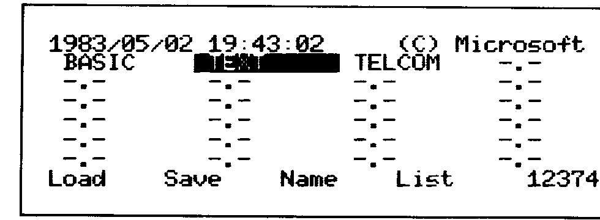
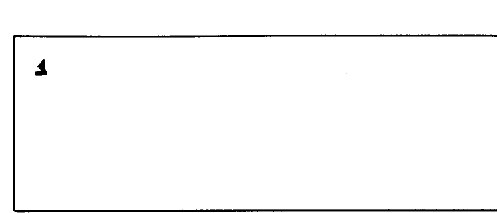
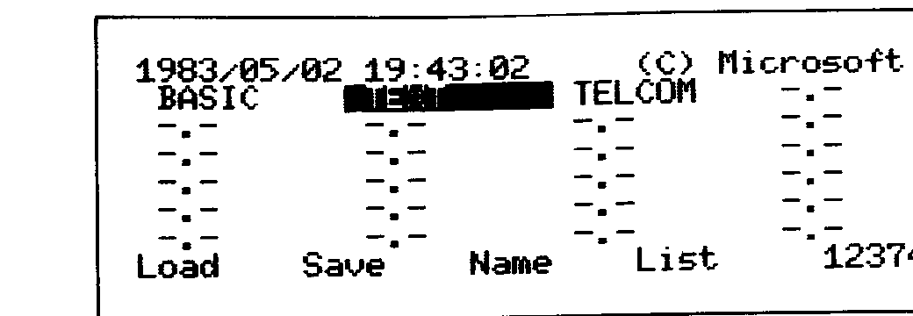
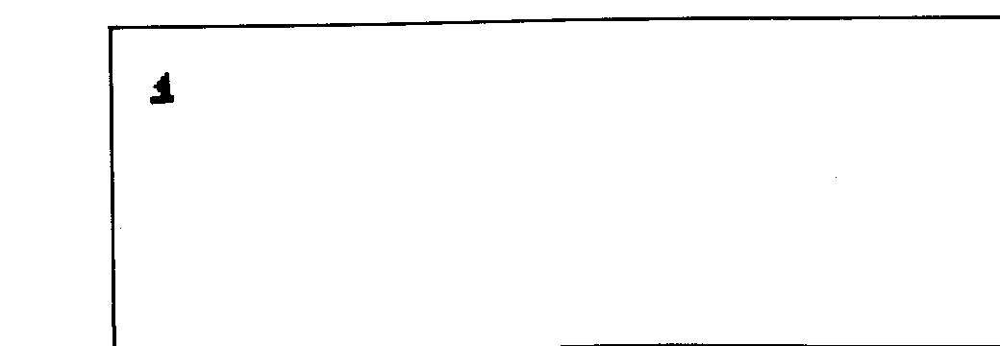
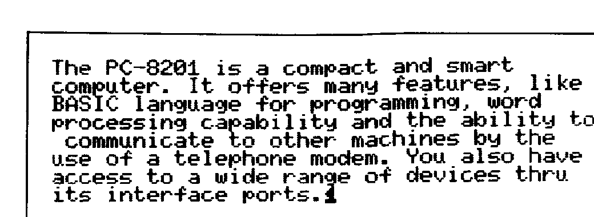
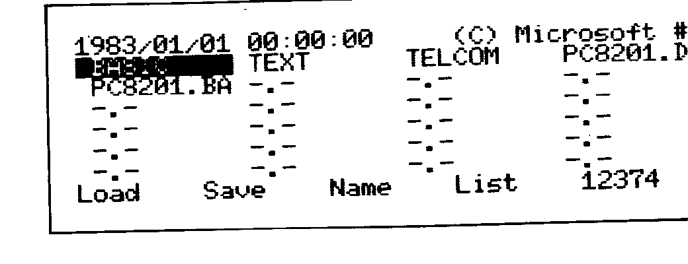
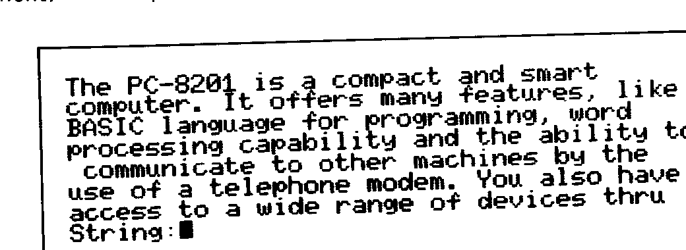
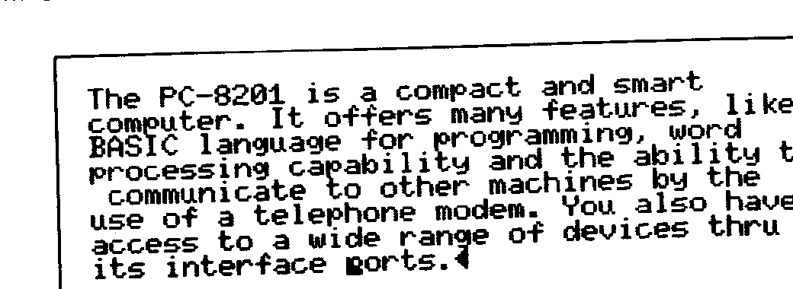
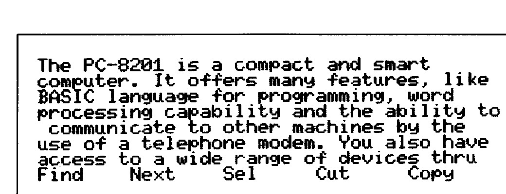
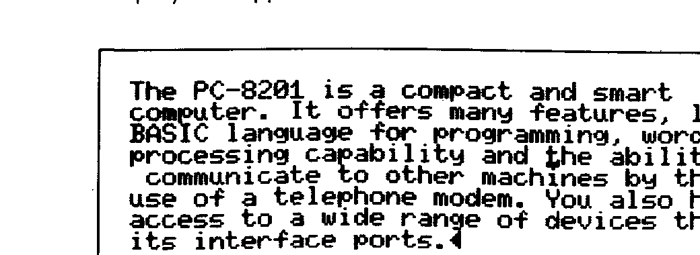

# Chapter 7: TEXT

> Vision-OCR'd from NEC8201A-UsersGuide.pdf (image-only scan, source pages 123-154 / printed 7-1..7-32), 2026-05-30.
> Figures/tables are transcribed per the project's per-figure-type policy; values flagged with TODO(tier-b) still need a human check against the scan.
> **Do not treat numeric/tabular values here as authoritative** — Tier B review pending.


## Overview

The `TEXT` mode is used to create and modify documents, such as memos, personal diaries, or any other type of text. The documents are stored in the PC-8201 memory or in an external device (a cassette tape), as TEXT files (.DO).

The use of the `TEXT` mode, in combination with the hardware and software features of the PC-8201, is unlimited. You can utilize the `TEXT` mode to create a document and then use the `PRINT` function of the MENU to print your document on a printer, use the `TELCOM` mode and a modem to transfer your document to your computer, printer, another machine, etc.

`TEXT` is a powerful, inexpensive wordprocessor that provides you with the following features:

- An LCD screen display with 8 lines of 40 characters per line
- Full screen line editing
- Easy cursor movement
- Repeat of keys while pressed down on the keyboard
- Automatic word wrap around
- Easy modification of lines or characters
- Easy addition of lines or characters
- Easy deletion of lines or characters
- Text split

Editing of documents can actually be easy due to the commands contained within the `TEXT` mode.

## TEXT Mode

The `TEXT` mode may be selected from the MENU in the following ways:

- By placing the cursor over the word "TEXT" and then pressing the [RETURN] Key.
- By placing the cursor over a selected text file name with the ".DO" extension and then pressing the [RETURN] Key.

When entering the `TEXT` mode by placing the cursor over the word "TEXT", the following display will be on the screen of the PC-8201:


<!-- source page 124 -->

If you want to modify an existing text file, enter the name of the file (document) to be edited. If you create a new file, the name that you wish to designate for the document is entered in response to the prompt "File to edit?". If nothing is input and the [RETURN] Key is pressed, the PC-8201 will return to the MENU mode.

> **REFERENCE:** The naming conventions for creation of file names have been described in Chapter 5.

> **NOTE:** Notice that the `TEXT` mode only has access to files with the extension ".DO". The file type extension is assumed to be ".DO" if it is not input.

> **CAUTION:** If you try to modify a file and you misspell the name, the PC-8201 will think you are entering the name of a new text file.

If an illegal file name is input, the "BEEP" sound will be generated and the prompt "File to edit?" will reappear. You should then enter a correct file name.

If you are composing a new document, the screen will appear as illustrated:


<!-- source page 125 -->

Now you are ready to start typing your text. If you are modifying an existing document or entering the `TEXT` mode by moving the cursor onto a specific file name and pressing the [RETURN] Key, the screen will be filled, starting with the first lines of your document.

At the end of your editing you can return to the MENU by pressing the f.10 Function Key ([SHIFT] and f.5 Keys pressed simultaneously), or by pressing the [ESC] Key twice.

> **REFERENCE:** Refer to the EDIT section of this chapter for more details on the creation or modification of documents.

**EXAMPLE:**

You are now ready to start modifying your document.

Now try to create a sample text file called PC8201. The file type extension ".DO" will be assigned automatically.

> **NOTE:** The file name "PC8201" was used earlier in Chapter 6. It may now be used again because that particular file was deleted in the example for the f.9/KILL function.

Start from the MENU mode by moving the cursor over the word "TEXT" and press the [RETURN] Key:


<!-- source page 126 -->

The prompt "File to edit?" will appear on the screen. Respond by typing in "PC8201":


<!-- source page 126 -->

After you input the [RETURN] Key the screen will appear as follows:


<!-- source page 126 -->

Now you can start typing your document. Notice the cursor is now a black line instead of the block seen in the MENU mode. Input the following sentences without pressing the [RETURN] Key. The word wrap feature will automatically wrap the words around to the next line if too long to fit on the current line:

The PC-8201 is a compact and smart computer. It offers many features, like BASIC language for programming, word processing capability and the ability to communicate with other machines by the use of a telephone modem. You also have access to a wide range of devices thru its interface ports.

Our screen display will appear as shown:


<!-- source page 127 -->

> **NOTE:** Notice that there are two symbols displayed beside the blinking cursor, when you are in the `TEXT` mode. They are "◄" and "↵".
>
> The "◄" marks the end of a file. No key input is allowed beyond this point. Any key input will be placed before this symbol. In other words, the input will be moved to the left of the symbol.
>
> The "↵" marks the end of a line. It is referred to as a "line feed" or "carriage return". Any key input beyond this symbol, within the same line, will be placed left of this symbol.

Now press the f.10 Function Key. Do not worry about typing errors at this point. You will be in the MENU mode and your file name "PC8201" is saved and appears on the screen:


<!-- source page 128 -->

## Cursor Operations

The cursor in the `TEXT` mode is described as a flashing black underline. The cursor position is very important since every function within the `TEXT` mode revolves around it.

The cursor is moved around the screen by using the Cursor Movement Keys. The cursor operations also include moving the cursor to the top of a document or to the end of it.

### Cursor Keys

FUNCTION:

Used to move the cursor on the screen in the direction of the arrow on the individual keys. Also used in combination with the [RETURN] Key and the [SHIFT] Key to perform special functions.

DESCRIPTION:

In order to move the cursor across the screen horizontally, use the [right-arrow] to move the cursor one character to the left. <!-- Tier-B confirmed against scan p128: the key icon is a right-pointing triangle but its function is to move the cursor LEFT. The cursor-key icons in this chapter read reversed vs. their function — confirmed source behavior, not an OCR error. --> The other Cursor Movement Keys are used to move the cursor to the right, up, or down. These Cursor Movement Keys will repeat automatically if you press them down for more than 1 second.

SPECIAL FUNCTIONS:

You can use the cursor keys in combination with the [RETURN] Key or the [SHIFT] Key to control the movement of the cursor within the text or the screen display area.

Descriptions of each special function of the cursor:

- [RETURN] + [down-arrow] will display the beginning of the document and move the cursor onto the first letter of the document.
- [RETURN] + [up-arrow] will display the end of the document and move the cursor onto the end of file symbol.
- [RETURN] + [right-arrow] will move the cursor to the beginning of the current line (where the cursor is located). <!-- Tier-B: reversed-icon behavior, consistent with the Fig 7.8 table (^Q / [CTRL]+[right-arrow] = left end of line). -->
- [RETURN] + [left-arrow] will move the cursor to the end of the current line. <!-- Tier-B: reversed-icon behavior, consistent with the Fig 7.8 table (^R / [CTRL]+[left-arrow] = right end of line). -->

### Screen Scrolling

When you are at the bottom line of your text and you press the [up-arrow] Key, all the lines will move upward (scroll) one line with the top line moving off the screen and a new line appearing at the bottom of the screen. The screen does not scroll if you are at the end of your text.

If you are at the top of your document, you can scroll the screen downward by using the [down-arrow]. You can also scroll the screen by using the Cursor Movement Keys as follows:

If the cursor is positioned at the first character of the screen and this is not the top of the text, and the [right-arrow] Key is input. <!-- Tier-B: reversed-icon behavior — the right-pointing key moves the cursor leftward/back, consistent with Fig 7.8. -->

If the cursor is positioned at the last character of the screen and this is not the end of the text, and the [left-arrow] Key is input. <!-- Tier-B: reversed-icon behavior — the left-pointing key moves the cursor rightward/forward, consistent with Fig 7.8. -->

If you use the [down-arrow] Key when you are at the top of the document, and the cursor is positioned on the first character of the text, the cursor will not move.

If you use the [up-arrow] Key when you are at the end of the document, and the cursor is positioned on the last line of the screen, the cursor will not move.

If you use the [up-arrow] Key when the cursor is positioned at the last character of the last line of the file, the cursor will not move.

- [SHIFT] + [down-arrow] will move the cursor to the corresponding position of the first line. For example, it the cursor is at position 20 of the 2nd line, it will be moved to position 20 of line first line.
- [SHIFT] + [up-arrow] will move the cursor to the bottom of the screen.
- [SHIFT] + [right-arrow] will move the cursor to the first character of a word, if it is positioned in the middle of a word. If the cursor is at the beginning of a word, this function will cause the cursor to move to the beginning of the previous word. <!-- Tier-B: reversed-icon behavior — right-pointing key moves to previous word (left); consistent with Fig 7.8 (^A = word left). -->
- [SHIFT] + [left-arrow] will move the cursor to the first character of the next word. <!-- Tier-B: reversed-icon behavior — left-pointing key moves to next word (right); consistent with Fig 7.8 (^F = word right). -->

You can perform all of the cursor functions described above by using the [CTRL] Key and particular letters simultaneously. The cursor functions available are listed:

<!-- Fig 7.8: Cursor operations / CTRL key equivalents table — source page 131. Tier-B verified cell-by-cell against scan; all CTRL letters and function text confirmed. Cursor-key icons read reversed vs. function (confirmed source behavior, not OCR error). -->

| CURSOR OPERATION | CTRL OPERATION | FUNCTION |
|---|---|---|
| [SHIFT] + [right-arrow] | ^A | Moves the cursor one word to the left |
| [SHIFT] + [up-arrow] | ^B | Moves the cursor downward one screen |
| [left-arrow] | ^D | Moves the cursor one character to the right |
| [down-arrow] | ^E | Moves the cursor up one line |
| [SHIFT] + [left-arrow] | ^F | Moves the cursor one word to the right |
| [CTRL] + [right-arrow] | ^Q | Moves the cursor to the left end of a line |
| [CTRL] + [left-arrow] | ^R | Moves the cursor to the right end of a line |
| [right-arrow] | ^S | Moves the cursor one character to the left |
| [SHIFT] + [down-arrow] | ^T | Moves the cursor upwards one screen |
| [CTRL] + [down-arrow] | ^W | Moves the cursor to the beginning of a file |
| [up-arrow] | ^X | Moves the cursor down one line |
| [CTRL] + [up-arrow] | ^Z | Moves the cursor to the end of a file |

## Special Keys

Following is a description of all the special keys that can be used under the `TEXT` mode:

### BS/BACKSPACE

FUNCTION:

The Back Space Key is used to erase characters directly to the left of the cursor.

DESCRIPTION:

Press the [BS] Key to activate the function. Each time the key is input, one character to the left of the cursor will be deleted and the remaining characters of the line will be pulled backward until a ↵ is pulled to the cursor position.

The back space has a built-in feature that allows for the back space to be repeated if the key is pressed for more than 1 second.

### DEL/DELETE

FUNCTION:

The DEL Key will delete (erase) the character at the point of the cursor position.

DESCRIPTION:

The DEL Key is input by pressing the [SHIFT] Key and the [BS] Key simultaneously. When the character at the cursor position is erased, the remaining characters to the right of the cursor will be moved one position to the left. The character immediately to the right of the cursor will then occupy the position directly under the cursor. The characters will be erased until a ◄ is encountered.

### INS/INSERT

FUNCTION:

Constantly ON.

DESCRIPTION:

When in the `TEXT` mode you will always be in the INSERT mode. The INSERT Key then has no function if it is input.

### ESC/ESCAPE

The ESC Key has only one function and it is described with the f.10 Function Key in this chapter.

### CTRL/CONTROL

FUNCTION:

Whenever a specific Ordinary Key is input in combination with this key it will perform a specific function.

> **REFERENCE:** See the BASIC Reference Manual.

## Automatic Word Wrap Around

When you are at the end of a line and the PC-8201 detects that you have entered a word that will not fit within the margins, the whole word will be moved to the next line.

## Function Keys

The `TEXT` mode has a special temporary work area in the RAM called the PASTE buffer. By using this region, you can copy the text situated in one portion into another location, or even another file. There are four commands, SELECT, CUT, COPY, and PASTE that will allow the use of the buffer. Also the `TEXT` mode offers two commands, FIND, and NEXT, which can be used to locate specific strings within a document.

Finally, there are two additional commands, KEYS and MENU which will allow you to display the command and to return to the MENU.

A variety of commands are used in the `TEXT` mode to accomplish these functions:

TO LOOK UP A STRING:

| Command | Description |
|---|---|
| FIND | Looks up a string |
| NEXT | Looks up the next string |

TO MOVE AND ERASE TEXT:

| Command | Description |
|---|---|
| SELECT | Designates a region for the CUT and COPY command functions |
| CUT | Transfers the portion designated by SELECT command to the PASTE buffer and erases it from the display. |
| COPY | Transfers the portion designated by SELECT command to the PASTE buffer and retains it on the display. |
| PASTE | Transfers the contents of the PASTE buffer to a file. |
| KEYS | On and off display of the command names. |
| MENU | Saves a file and returns the PC-8201 to the MENU mode. |

## f.1/FIND

FUNCTION:

The FIND command searches the document being edited for a designated string of characters.

DESCRIPTION:

Press the f.1 Function Key to execute the FIND command. The seventh or eighth line of the screen, depending on whether or not the function commands on the eighth line are displayed, will have the following prompt displayed:

        String:

The cursor will be flashing next to the prompt.

You are being requested to specify a string, up to 24 characters in length, that you want to find within the document. The string can include any letter or number keys, including spaces. It must not include quotation marks. If you attempt to input more than 24 characters the "BEEP" sound will be generated and the additional characters will be rejected.

If you had been previously searching for a string and you later input the f.1 Function Key again, the prompt "String:(previously selected string)" will appear on the screen. This is because the FIND command can be used in combination with the NEXT command to achieve consecutive searches of the same string.

If you want to change the string specified, press the f.1 Key and input your new string. If you press the f.1 Key and then the [RETURN] Key, nothing will happen and the old string is still retained.

> **NOTE:** Remember that the flashing cursor is indicating that you must input the characters of a string.

The only keys that will input during the string prompt are letter and number keys, the [RETURN] Key, and the [SHIFT] Key, the [STOP] Key, the [RETURN] + C, the [RETURN] + M, line feed, and [RETURN] + J.

To exit from the "String:" prompt, press the [RETURN] Key or the [SHIFT] Key and [STOP] simultaneously.

EXAMPLES:

Use your previously created document "PC8201.DO". While in the MENU mode, position the cursor over the file name "PC8201.DO" and press the [RETURN] Key. Your screen will display the document. Now press the f.1 Function Key. Your screen will display:


<!-- source page 136 -->

Input "ports" and press the [RETURN] Key. The screen will appear as illustrated:


<!-- source page 136 -->

The cursor will be flashing under the "p" of the word "ports". Now input the f.1 Function Key again and the last line of the screen will display:

        String:ports

This is because the PC-8201 remembers the last string, making consecutive searches easier. Consecutive searching is performed by the use of the NEXT command in combination with the FIND command.

Press the [RETURN] Key and the last line of your screen will display the message:

        "No match"

This is because the search starts after the letter "p" of the word "ports", and the remainder of your text file does not contain that word. Now move the cursor one position to the left, so that it is positioned at the space just before the word "ports".

Again press the f.1 Function Key. The cursor will move to the position of the "p" in the word "ports" because it found the string being searched for in the FIND command.

Now press the f.1 Function Key and the [SHIFT] Key simultaneously. The function commands will be displayed on the last line of the screen as illustrated:


<!-- source page 137 -->

Repeat the previous steps at this point and you will notice that the prompt and message, "String:" and "No match" will be moved up to the seventh line of the screen.

---

## f.2/NEXT

FUNCTION:

This command is used in combination with the FIND command to perform consecutive searches of the same string.

DESCRIPTION:

The NEXT command is activated by pressing the f.2 Function Key. The PC-8201 will execute a FIND command with the string previously designated. If no string was specified, a "No match" message will be displayed.

When you enter the TEXT mode and input the f.2 Function Key without designating a string through the FIND command, nothing will happen.

The rules applied to the NEXT command are the same as those for the FIND command.

EXAMPLES:

Again select the file "PC8201.DO" from the MENU. Input f.1 and type in the word "the" in response to the prompt, and press [RETURN]:

        String:the

The display will appear as shown:


<!-- source page 138 -->

The cursor will be flashing under the letter "t" of the string "the ability".

Now input the f.2 Function Key and the cursor will flash under the "t" of the word "other". Input f.2 again and the cursor will be flashing under the "t" of the string "the use".

Input f.2 again and the message "No match" will be displayed, since there is not another "t" in the remainder of the document.

Return to the MENU by pressing the f.10 Function Key. Re-enter the TEXT mode and select your file "PC8201.DO". Input the f.2 Function Key. Nothing will happen since there was no string specified.

---

## f.3/SEL

FUNCTION:

The SELECT command allows you to select a portion of your document to be moved into a working area within the memory of the PC-8201. This working area is the PASTE buffer.

DESCRIPTION:

Press the f.3 Function Key to activate the SELECT command. The Cursor Movement Keys are used to designate the area in which you can copy or move. The CUT command will move the portion of the file designated and erase it, while the COPY command will just copy the portion of the file into the PASTE buffer.

As mentioned, the cursor movements are used to define the area that you will SELECT.

EXAMPLES:

Once again, select the file "PC8201.DO". We will SELECT the last sentence to COPY into the PASTE buffer. Use the Cursor Movement Keys to position the cursor under the "Y" of the word "You" and then input the f.3 Function Key. You are now in the SELECT mode.

Use the [right-arrow] Key to move the cursor to the right. As you can see, the characters that the cursor passed over become reverse image, with a black background. These characters have been selected for the move.

Now press the [left-arrow] Key and you will see that the characters passed over by the cursor reverts back to the normal image, with a white background. If the [up-arrow] Key is input, the next 40 characters will be selected, starting with the one the cursor was positioned under. If you use the [down-arrow] Key, the 40 selected characters will revert back to normal.

Input the [STOP] Key to get out of the SELECT command mode, and then move the cursor under the "Y" of the word "You" and input the f.3 Function Key. Then press the [up-arrow] Key twice. Notice that the second time 40 characters were not selected because the end of the document was reached with less than 40 characters remaining.

The screen will now appear as illustrated:

<!-- FIGURE 7.13: Screen with last sentence selected in reverse video — source page 141 (target: image) -->

```text
The PC-8201 is a compact and smart
computer. It offers many features, like
BASIC language for programming, word
processing capability and the ability to
 communicate to other machines by the
use of a telephone modem. [You also have
access to a wide range of devices thru
its interface ports.]◄          -
```

<!-- TODO(tier-b): verify reverse-video selection extent (which chars highlighted) against source page 141 -->

Now you can press the f.5 Function Key to copy that sentence into the PASTE buffer. After this, the last sentence is released for normal use.

You can also select a portion of a document by moving the cursor to the character next to the last character of the section you want to select and move the cursor key in reverse direction. For example, the [down-arrow] Key will now select 40 characters instead of the [up-arrow] Key.

If you are trying to select the top line of the document or the bottom line of the document by using the [up-arrow] or [down-arrow] Keys, you might select only some of the characters, depending upon the location of the cursor. In such a case, use the [right-arrow] or the [left-arrow] Keys to select the rest of the characters.

When you are executing the SELECT command and you try to edit the file, the SELECT command is deactivated. You can also deactivate the command by pressing the [STOP] Key or the [RETURN] + C Keys.

> **NOTE:** Whenever you SELECT a portion of a document to move to the PASTE buffer, remember that when the CUT or COPY command is executed it will write over the existing contents of the PASTE buffer.

---

## f.4/CUT

FUNCTION:

This command, executed after a SELECT command, will move the selected section of the document into the PASTE buffer and then erases it from the document.

DESCRIPTION:

Press the f.4 Function Key to execute the CUT command.

EXAMPLE:

Use the same example as in the SELECT command. After you have selected the last statement of the "PC8201.DO" document, press the f.4 Function Key. The screen will appear as illustrated:

<!-- FIGURE 7.14: Screen after CUT — last sentence removed, cursor at end of remaining text — source page 142 (target: image) -->

```text
The PC-8201 is a compact and smart
computer. It offers many features, like
BASIC language for programming, word
processing capability and the ability to
 communicate to other machines by the
use of a telephone modem. ↵
```

To verify that we actually moved the last statement in the PASTE buffer, just press the PAST Key and [SHIFT] Key simultaneously. The screen will revert back to the original display:

<!-- FIGURE 7.15: Screen after PASTE verification — original text restored — source page 142 (target: image) -->

```text
The PC-8201 is a compact and smart
computer. It offers many features, like
BASIC language for programming, word
processing capability and the ability to
 communicate to other machines by the
use of a telephone modem. You also have
access to a wide range of devices thru
its interface ports.↵
```

> **NOTE:** A distinction should be made between the [DEL] Key and the CUT command. When you DELETE a character by means of the DEL Key or BS Key, that character is not saved as with the CUT command.

---

## f.5/COPY

FUNCTION:

The copy command performs the same function as the CUT except that it does not erase the SELECTED portion of a document.

DESCRIPTION:

Input the f.5 Function Key to execute the COPY command.

EXAMPLE:

Again use the same example as for the CUT and SELECT commands. After selecting the last sentence of the "PC8201.DO" document, press the f.5 Function Key. The screen will change to a normal background, and the SELECT mode will be deactivated.

To verify that we moved the contents to the PASTE buffer, move the cursor onto the "◄" and press the [RETURN] and [SHIFT] Keys simultaneously. The screen will display:

<!-- FIGURE 7.16: Screen after COPY+PASTE — duplicated last sentence appended — source page 144 (target: image) -->

```text
BASIC language for programming, word
processing capability and the ability to
 communicate to other machines by the
use of a telephone modem. You also have
access to a wide range of devices thru
its interface ports.You also have access
 to a wide range of devices thru its
interface ports.↵
```

## f.6/KEYS

FUNCTION:

This command displays the commands of the corresponding Function Keys, which appear on the last line of the screen.

DESCRIPTION:

To activate this command, press the f.6 Function Key ([SHIFT] and f.1). If the commands of the Function Keys are already displayed on the screen, then pressing the f.6 Key will clear the last line of the screen. This allows the last line to be utilized for text editing.

If the last line is used for text editing, then the following will happen:

- If the screen is full and the end of text and the cursor is at the last line of the text, all of the lines will move up one line with the top line moving off the screen. The bottom line will then display the names of the Function Keys.

- If the screen is full and at the beginning of the document, or the cursor is not at the bottom or top line, the Command line will push the last line of the text off the screen.

- If the screen is not full, then the following screen will be displayed:

<!-- FIGURE 7.17: Screen mockup — f.6/KEYS command with function key bar displayed, screen not full — source page 145 (target: ascii) -->

```text
processing capability and the ability to
 communicate to other machines by the
use of a telephone modem. You also have
access to a wide range of devices thru
its interface ports.◄

Find    Next    Sel     Cut     Copy
```

<!-- TODO(tier-b): verify cursor glyph and exact spacing of function key bar against source page 145 -->

The seven lines will be displaying your document. Notice that the last line is the same as in the case when the screen is full.

The screen appears as follows when the first five functions are displayed on the last line of the screen:

<!-- FIGURE 7.18: Screen mockup — f.6/KEYS with first five function key names on last line — source page 146 (target: ascii) -->

```text
processing capability and the ability to
 communicate to other machines by the
use of a telephone modem. You also have
access to a wide range of devices thru
its interface ports.◄

Find    Next    Sel     Cut     Copy
```

<!-- TODO(tier-b): verify exact tab spacing of function key labels against source page 146 -->

When the [SHIFT] Key is depressed, the names of functions 6 and 10 are displayed in the last line:

<!-- FIGURE 7.19: Screen mockup — f.6/KEYS with SHIFT held, showing Keys and Menu labels — source page 146 (target: ascii) -->

```text
processing capability and the ability to
 communicate to other machines by the
use of a telephone modem. You also have
access to a wide range of devices thru
its interface ports.◄

Keys                            Menu
```

<!-- TODO(tier-b): verify spacing between "Keys" and "Menu" labels against source page 146 -->

You can always alternate between displaying or erasing the last line (command line) by pressing the f.6 Function Key.

---

## f.10/MENU

FUNCTION:

The MENU command allows you to return to the MENU screen.

DESCRIPTION:

To execute the MENU command, input the f.10 Function Keys or the [MENU] Key twice. The PC-8201 will save the edited document under the name you designated in the second step before entering the TEXT mode. The PC-8201 will return to the MENU after saving your document in the RAM.

If you omitted the ".DO" extension when you specified the file name, the PC-8201 will automatically assign the ".DO" extension.

When in the MENU mode, you will notice that the name of the file you were editing will appear on the screen:

<!-- FIGURE 7.20: MENU screen mockup showing PC8201.DO highlighted after returning from TEXT — source page 147 (target: ascii) -->

```text
1983/01/01  00:00:00        (C) Microsoft #1
████████  TEXT      TELCOM      PC8201.DO
PC8201.BA  -.-
-.-        -.-       -.-         -.-
-.-        -.-       -.-         -.-
-.-        -.-       -.-         -.-
-.-        -.-       -.-         -.-
Load    Save    Name    List    12374
```

<!-- TODO(tier-b): verify highlighted filename field and exact spacing of MENU screen against source page 147 -->

---

## PAST/PASTE

FUNCTION:

This command will copy the contents of the PASTE buffer into your document.

DESCRIPTION:

To execute this command first place the cursor one position to the left of the point where you want to start copying the contents of the PASTE buffer. Then press the PAST and [SHIFT] simultaneously. If the buffer is not empty its contents will be copied into the area to the right of the cursor. You can copy the PASTE buffer within the same document as many times as you want, as long as its contents remain intact.

EXAMPLE:

When you have selected the "PC8201.DO" file as in the previous examples, the screen will appear as illustrated:

<!-- FIGURE 7.21: Screen mockup — full document text with cursor at end before PASTE — source page 148 (target: ascii) -->

```text
The PC-8201 is a compact and smart
computer. It offers many features, like
BASIC language for programming, word
processing capability and the ability to
 communicate to other machines by the
use of a telephone modem. You also have
access to a wide range of devices thru
its interface ports.◄    _
```

<!-- TODO(tier-b): verify cursor position and underscore character against source page 148 -->

A paste buffer with the following contents:

```text
You also have
access to a wide range of devices thru
its interface ports.
```

To copy the PASTE buffer, move the cursor to the position to the right of "◄", and then press the [MENU] Key and [SHIFT]. The screen will change as illustrated:

<!-- FIGURE 7.22: Screen mockup — document after PASTE buffer copied in, showing duplicated text — source page 149 (target: ascii) -->

```text
BASIC language for programming, word
processing capability and the ability to
 communicate to other machines by the
use of a telephone modem. You also have
access to a wide range of devices thru
its interface ports.You also have access
 to a wide range of devices thru its
interface ports.◄
```

<!-- TODO(tier-b): verify exact line-wrap and joined text at paste point against source page 149 -->

---

## RETURN KEY

FUNCTION:

Allows new line feed, performs text split, and inputs characters pressed on the keyboard.

DESCRIPTION:

The [ENTER] Key is also known as the ENTER Key. When in the TEXT mode, the [ENTER] Key functions in two different ways. First, it is used to input commands or statements into the PC-8201 after they have been typed, similar to when the BASIC or TELCOM modes are utilized. It also allows a new line feed (carriage return or return code) and performs text split.

Upon entering the TEXT mode, notice that the cursor is always in the upper left corner of the screen (home position). To insert a new line, simply press the [ENTER] Key and a new line (blank at this time) will be inserted preceding the line containing the cursor.

To add new blank lines anywhere on the screen, simply move the cursor to the desired position using the Cursor Movement Keys, [GRPH], and pressing the [ENTER] Key.

When the [ENTER] Key is pressed after the first line is filled, the 41st character is occupied at the first position on the second line feed. This line continues until the [ENTER] Key is pressed again. This establishes the end of the line symbol "◄". Most printers support up to a maximum of 133 characters per line. Any additional data may not be printed.

The [ENTER] Key can also be used to perform text split. When editing memos, letters, etc. If a segment of a text line is to be moved onto a new line, the text split feature makes this process possible. Simply move the cursor by using the Cursor Movement Keys to the desired position (where the split is to start) and press the [ENTER] Key. Notice that the segment to the right of the cursor, including the cursor position, is moved onto a new line.

> **NOTE:** If the [ENTER] Key is pressed by accident, the process can be reversed by pressing the [DEL] Key.

---

## EDIT

The EDIT mode is used to both compose a new document or to modify an existing document.

During an EDIT session (the time you start editing until the time the edited document is saved), you will be using a lot of the commands and special Keys that have already been described in this manual.

The use of the Ordinary Keys is the same as any typewriter, with the exception of your input being saved in the RAM of the PC-8201. Of course it is much easier to correct mistakes, rearrange the document and so on.

When you edit an existing text, the original text is not saved, so if you decide you want to go back into the original text, before modifications, it may not be possible. If one of the following situations is true you may be able to go back to the original file:

- You can save the document file on an external device (a cassette tape), before modifying the document in the RAM.

- You can move your document within the PASTE buffer by using the SELECT and COPY commands and then enter the TEXT mode with a different name. You can then use the PASTE command to save the original document under the new name.

Once you have secured the original document under a different file name, you can go ahead and modify.

While in EDIT it is possible that you could run out of space in the RAM. In such a case the message:

"Memory Full"

will be displayed on the seventh line if the function commands are displayed on the last line. It will be displayed on the last line if the function commands are not being displayed at the time.

If you get the "Memory full" message, you will have to create some space in the RAM by moving or deleting (KILL) some of your files if you want to complete the editing of your document.

---

## TAB KEY

FUNCTION:

Used to arrange columns in a chart or table.

DESCRIPTION:

The following figure shows that the tab stops are set every eighth column on the screen. These tab stops are transparent to the display:

<!-- FIGURE 7.23: Tab-stop grid diagram — 8 rows × 40 columns, tab stops at columns 1, 9, 17, 25, 33 shown as dark bars — source page 153 (target: ascii) -->

```text
         1         9        17        25        33
         |         |         |         |         |
row 1  [ tab ]   [ tab ]   [ tab ]   [ tab ]   [    ]
row 2  [     ]   [     ]   [     ]   [     ]   [    ]
row 3  [     ]   [     ]   [     ]   [     ]   [    ]
row 4  [     ]   [     ]   [     ]   [     ]   [    ]
row 5  [     ]   [     ]   [     ]   [     ]   [    ]
row 6  [     ]   [     ]   [     ]   [     ]   [    ]
row 7  [     ]   [     ]   [     ]   [     ]   [    ]
row 8  [     ]   [     ]   [     ]   [     ]   [    ]
```

<!-- TODO(tier-b): verify exact column numbers (1, 9, 17, 25, 33) and grid layout against source page 153 -->

Start a new line and press the [TAB] Key (or press [CTRL] + I). The cursor is automatically moved to the nearest tab position in the forward direction.

Any text that is located to the right of the cursor, and the cursor position, is moved to the right to the next tab position. For example, type in the following and move the cursor to column 5. Press the [TAB] Key. Figure 2 shows the result:

<!-- FIGURE 7.24: Two-row diagram showing before/after TAB key press — text shifts from col 5 to next tab stop — source page 153 (target: ascii) -->

```text
         1    5    9        17        25        33
1.  [ AA | AAAA | BBB |  | CCC |  |  |  |  |  |  |  |  |  |  ]
              \       [TAB] Key      /
2.  [  AA |    | AAAA | BBB |  | CCC |  |  |  |  |  |  |  |  ]
```

<!-- TODO(tier-b): verify column positions and label characters (AA, AAAA, BBB, CCC) in tab diagram against source page 153 -->

If the [DEL] Key is used, the reverse process will occur and the original display will reappear.

When the tab is moved over, the vacant space caused by tab movement consists of a null code. The tab code then can be set before the tab location. When the tab code is erased, the cursor and the text will revert to the original locations:

<!-- FIGURE 7.25: Three-row grid showing TAB null-code and DEL effect — columns 1–13 — source page 154 (target: ascii) -->

```text
     1  2  3  4  5  6  7  8  9  10 11 12 13
     |  |  A  A  |  A  A  A  A  |  |  |  |
                 [TAB]↑          ↑[DEL]
     |  |  A  A  |  |  |  |  |  A  A  A  A
```

<!-- TODO(tier-b): verify null-code positions and exact column layout of TAB/DEL diagram against source page 154 -->

Characters can be input in sequence to the left of the null location.

In order to fully understand the [TAB] Key uses and advantages, it is wise to experiment with the [TAB] Key function using a test file. Now use the [TAB] Key to input a simple chart as indicated below:

<!-- FIGURE 7.26: Baseball stats table — PLAYER/AT BATS/HITS/WALKS/AVERAGE — source page 154 (target: table) -->

| PLAYER  | AT BATS | HITS | WALKS | AVERAGE |
|---------|---------|------|-------|---------|
| Smith   | 50      | 6    | 7     | 0.139   |
| Jones   | 30      | 9    | 4     | 0.346   |
| Brown   | 68      | 3    | 5     | 0.476   |
| Johnson | 70      | 25   | 8     | 0.403   |
| White   | 64      | 23   | 6     | 0.396   |
| Jackson | 54      | 15   | 4     | 0.300   |

<!-- TODO(tier-b): verify all numeric cell values (AT BATS, HITS, WALKS, AVERAGE) against source page 154 — Brown HITS reads "3", Johnson HITS reads "25", averages may be ambiguous at scan resolution -->
