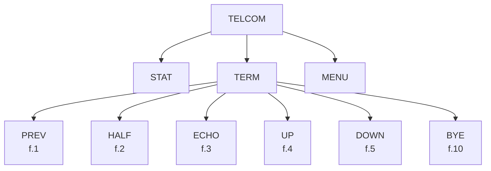

# Chapter 8: TELCOM

> Vision-OCR'd from NEC8201A-UsersGuide.pdf (image-only scan, source pages 156-181 / printed 8-1..8-26), 2026-05-30.
> Figures/tables are transcribed per the project's per-figure-type policy; values flagged with TODO(tier-b) still need a human check against the scan.
> **Do not treat numeric/tabular values here as authoritative** — Tier B review pending.


## Overview

TELCOM is a software feature that enables the PC-8201 to communicate with other computers through the use of a telephone modem with the RS-232C interface. When in the TELCOM mode, the RS-232C interface allows the PC-8201 to be used as a terminal. Therefore, the PC-8201 possesses strong communication capability to external equipment, thus making it an exceptional terminal:

- By designating only the parameter of STAT command, the communication format can be freely altered.

- By using an escape sequence, the capability of cursor movement can be easily controlled.

- Through the use of an "x" parameter, data communication can continue while printing output at a baud rate of up to 19200.

- Through the use of DOWNLOAD command, data received from the RS-232C circuit can be saved in the RAM of the PC-8201. Data can be sent to another computer for storage through the use of UPLOAD command.

The TELCOM software feature has three main commands:

    MENU

    STAT

    TERM

The TERM mode has six subcommands that can be executed by pressing their respective Function Keys:

    f.1   PREVIOUS

    f.2   HALF/FULL

    f.3   ECHO

    f.4   UPLOAD

    f.5   DOWNLOAD

    f.10  BYE

To operate in TELCOM, the PC-8201 must have an external modem, connection cable, and a telephone.

## Starting TELCOM

Move the cursor onto the word TELCOM in the MENU mode. Select this feature by pressing the [RETURN] Key. The following display will be on your screen:

```text
8171XS
Telcom: _

                          Stat    Term
```

<!-- FIGURE 8.1: TELCOM startup screen mockup — source page 157 (target: table) -->

The "8171XS" appearing on the first line is the parameter which displays the current data transmission format.

> **REFERENCE:** Refer to the section in this chapter on STAT command for further details.

The word "TELCOM" appearing on the second line is a prompt (a message that requests user input). This indicates that the PC-8201 is entering the TELCOM mode, which takes precedence over the TERM (terminal) mode. TELCOM mode determines the data transmission format.

The PC-8201 reserves and uses the last line of the screen to display the STAT command input by the f.4 Function Key, and the TERM command input by the f.5 Function Key. Press the [SHIFT] Key and the "MENU" command will display on the last line of the screen. This is the f.10 Function Key ([SHIFT] and f.5).

When the prompt of "TELCOM:" is indicated, only these three commands are accepted:

    STAT      f.4 Function Key

    TERM      f.5 Function Key

    MENU      f.10 Function Key

The rest of the function keys are ignored. Any characters input with the [RETURN] Key will cause the "BEEP" sound to be generated, signifying that an input error has occurred.

## Commands

In addition to the three commands mentioned, there are also six commands available in the TERM mode:

<!-- FIGURE 8.2: TELCOM command tree (STAT, TERM, MENU; TERM subcommands: PREV f.1, HALF f.2, ECHO f.3, UP f.4, DOWN f.5, BYE f.10) — source page 159 (target: mermaid) -->



<!-- TODO(tier-b): verify TERM subcommand labels (PREV/UP/DOWN vs PREVIOUS/UPLOAD/DOWNLOAD) against source page 159 -->

When in the TELCOM mode, the three commands of STAT, TERM, and MENU can be input by pressing their Function Keys or directly input as words. However, when in TERM mode, you will have to utilize the command keys by pressing their function key. In the case of a command being input but not displayed, the command was not transmitted.

> **NOTE:** If the PC-8201 is in TERM mode, it should be noted that the PC-8201 communicates through the RS-232C line. For this reason you should be certain that it is hooked up to an RS-232C circuit. The modem is hooked up to the PC-8201 RS-232C interface.

## f.4/STAT

FUNCTION:

This command changes the previous communication format to a new format, which will be saved as the default value.

DESCRIPTION:

When STAT is input without adding any parameters, TELCOM indicates the current communication format. In order to change the communication format, utilize the STAT command with a six-character parameter attached after the command, as follows:

    STAT ( CPBSXS )

where CPBSXS stands for:

    C   Communications speed (BAUD RATE)
    P   Parity
    B   Word length
    S   Stop bit
    X   Control according to "x" parameter
    S   Control according to shift in/out sequence

Each different character of the parameter is controlled by a different feature of the communication format.

The following are the values for each different feature of the communication format:

<!-- FIGURE 8.3: STAT parameter value table (Communication Speed, Parity, Word Length, Stop Bit, X-param control, Shift in/out control) — source pages 160–162 (target: table) -->

| Parameter | Value | Meaning |
|-----------|-------|---------|
| **Communication Speed (Baud Rate)** | | |
| C | 1 | 75 bps |
| C | 2 | 110 bps |
| C | 3 | 300 bps |
| C | 4 | 600 bps |
| C | 5 | 1200 bps |
| C | 6 | 2400 bps |
| C | 7 | 4800 bps |
| C | 8 | 9600 bps |
| C | 9 | 19200 bps |
| **Parity** | | |
| P | N | No Parity |
| P | E | Even Number Parity |
| P | O | Odd Number Parity |
| P | I | Parity bit ignored |
| **Word Length** | | |
| B | 6 | 6 Bit Length |
| B | 7 | 7 Bit Length |
| B | 8 | 8 Bit Length |
| **Stop Bit** | | |
| S | 1 | 1 Stop Bit |
| S | 2 | 2 Stop Bits |
| **Control According to "x" Parameter** | | |
| X | X | Affects Control |
| X | N | Does Not Affect Control |
| **Control According to Shift In/Out Sequence** | | |
| S | S | Affects Control |
| S | N | Does Not Affect Control |

<!-- TODO(tier-b): verify parity value "I" (Parity bit ignored) glyph — could be "I" or "1" — against source page 161 -->

Parity bit ignore designation must be used with an 8 bit word length. When a parity error occurs during the operation of TELCOM, this error will not be recognized as an error. Data will still be considered good.

The capacity of the input buffer is up to 250 characters. When data is filled to within 23 characters in the buffer, the PC-8201 will output a CTRL + S code (19) and request a temporary cessation of data transmission from the other end.

When the buffer is empty, a CTRL + Q (17) is output and resumption of transmission will be requested. In the same manner when data is transmitted and a CTRL + S code is received, the PC-8201 will accept that code as a control signal and not as data. It will also stop transmission until a CTRL + Q code has been sent.

If you need the display to scroll by one line then preparation is required if data is to be transmitted to a printer. This is why if a data transmission control is not conducted by the X parameter during high speed data transmission, the buffer will immediately overflow and the transmitted data will be lost.

> **REFERENCE:** See the Table of Control Codes in this chapter for details on the CTRL functions and the corresponding codes.

PRECAUTIONS:

A data transmission format designated by STAT command cannot be changed once the electrical power switch has been turned OFF. A designated value will also be effective when the designation of "CPBSXS" is abbreviated with an OPEN "COM:" command in BASIC. On the other hand, when a new data transmission format is designated, the value (designated in BASIC) is effective in the TELCOM mode as well.

EXAMPLES:

    STAT 8171XS

        9600 bps
        Parity ignored
        Word length 7 bits
        1 stop bit
        Control affected by means of the X parameter
        Control affected by means of SI/SO sequence

> **NOTE:** This is the value after a cold start.

    STAT 3N72NN

        300 bps
        No parity
        Word length 7 bits
        2 stop bits
        Control unaffected by means of an X parameter
        Control unaffected by SI/SO sequence

> **REFERENCE:** Consult the instruction manual provided with the modem for details about its installation and use.

## f.5/TERM

FUNCTION:

This command switches the PC-8201 from the TELCOM mode into the TERM mode, and preparations should be made to open the communication line.

DESCRIPTION:

To use the PC-8201 as a terminal using the RS-232C line, the user must set or confirm the data transmission format after the TELCOM has been activated. Input the f.5 Function Key or input the word "TERM" and press [RETURN] to execute the TERM command. Be certain that the PC-8201 is in proper configuration for data transmission after execution of the TERM command.

There are six commands available in the TERM mode. Once in the TERM mode, each command is respectively assigned to a function key and input of the command is executed by pressing that function key:

    1    PREVIOUS
    2    HALF/FULL
    3    ECHO
    4    UPLOAD
    5    DOWNLOAD
    10   BYE

The f.6, f.7, f.8, and f.9 Function Keys are not used in the TERM mode.

PRECAUTIONS:

In TERM mode, if data is not accepted for any reason, then a checked pattern is substituted for the characters displayed. The communication format is probably in error if numerous checked patterns appear on the screen. In such a case, return to TELCOM mode and confirm the designated format.

If nothing is displayed on the screen, the data transmission must be extremely different from the designated one.

The PC-8201 can transmit graphic characters if the word length is 8 bit (in the same manner where 7 bit length or SI/SO sequence is used). However, even if the data transmission unit on the other end is not equipped to accept graphics, it will be displayed on the screen of the PC-8201 just as if they were being normally transmitted.

With graphics characters in particular, a variety of figures can be displayed by using the proper device. There are also situations when a graphics character could be used as a function code. You should pay attention to the type of character set used by the communication equipment at the receiving end.

When the PC-8201 is used as a terminal with mainframe (large computers), there are instances using the cursor movement keys to revise the input. What is normally displayed on the screen of the PC-8201 is what has been input, so determine the PC-8201 cursor movement code as a single letter in terms of the mainframe computer, etc., becuase <!-- OCR: unclear ("becuase" — probable source typo, preserved) --> revision cannot be done. Afterwards when you do want to revise a letter that has been input, use the [BS] Key (character code 8).

> **REFERENCE:** See the end of this chapter and Appendix C for the Character Code (ASCII) Table.

## f.10/MENU

FUNCTION:

This command completes the TELCOM mode and returns the PC-8201 to the MENU mode.

DESCRIPTION:

When the PC-8201 is in the TELCOM mode, the MENU command can be executed by two methods:

1. You may press the f.10 Function Key ([SHIFT] and f.5).

2. You may also type in the word "MENU" and then press [RETURN].

The PC-8201 will be returned to the MENU mode in either case.

## TERM SUBCOMMANDS:

### f.1/PREVIOUS

FUNCTION:

Display the previous screen (page).

DESCRIPTION:

In TERM mode, a screen (page) portion (8 lines x 2 screens) can be maintained as screen display. Only the second screen (page) can be displayed normally, however the lines that disappear from the screen due to scrolling are sent to the former first screen (page).

The PREVIOUS command is used to view the lines (up to eight) just before they disappear from the screen by scrolling.

Press the f.1 Key in TERM mode to allow the first screen (page) to be displayed. Press the f.1 Key again to return to the second screen (page). The first screen is used for display purposes only, as data communication is not allowed here. Any keys input will cause the return to the second screen.

When the first screen is displayed, any data received is stored in the buffer and the operation to write into the second page is not performed. If communication is performed without being controlled by an "x" parameter, data is accumulated in the buffer and any overflow will be lost.

## f.2/HALF/FULL

FUNCTION:

Converts from Half Duplex to Full Duplex data transmission.

DESCRIPTION:

If the f.2 Function Key is used to input the TERM command, the data transmission format switches from Half Duplex to Full Duplex (or vice-versa). This conversion is indicated by the command displayed as "Half" or "Full":

```text
8171XS
Telcom: Term
■

Prev    Full         Up      Down
```

One replaces the other each time the f.2 Function Key is input:

```text
8171XS
Telcom: Term
■

Prev    Half         Up      Down
```

In the Full Duplex communication, data transmitted by the PC-8201 must be transferred again from the equipment on the receiving end. Only the transmitted data from the receiving side is displayed on the PC-8201 screen. On the other hand, in Half Duplex communication, data transmitted from the PC-8201 does not require return communication from the receiving side. So the data displayed on the screen is the data input through the keyboard. This is known as "self-echo" which displays the transmitted data from the PC-8201.

When the PC-8201 is used as a terminal for mainframe (large computer), the Full Duplex format is used and when the PC-8201 is connected to another personal computer for data transmission the Half Duplex format is used.

> **NOTE:** The Half Duplex format indicates that transmitting and receiving cannot be executed simultaneously (namely, when one computer transmits, the other can only receive). While in Full Duplex format, transmission and reception are executed simultaneously. The PC-8201 has the capacity for a true Full Duplex communication. The format of the command can be switched even if the ECHO is being used.

## f.3/ECHO

FUNCTION:

Transmitted data could be printed on a printer, if chosen.

DESCRIPTION:

When in TERM mode, the position corresponding to the f.3 Function Key on the screen is blank. If you input the f.3 Function Key, the word "Echo" is displayed. Any data received after the f.3 Key is input is sent to a printer. If the f.3 Function Key is input again, the word "Echo" is erased from the display and data will not be sent to the printer:

```text
8171XS
Telcom: Term
■

Prev    Full         Up      Down
```

The display after the f.3 Key has been input a second time:

```text
8171XS
Telcom: Term
■

Prev    Full    Echo    Up      Down
```

Data received through the RS-232C circuit is stored in the buffer of the PC-8201 and then transmitted to the printer.

The data sent to the printer will not be lost because a "handshaking" can be conducted between the PC-8201 and the printer. However, data transmission is halted if the ECHO command is executed when the printer is not properly connected. In such a case, output to the printer can be interrupted if both the [SHIFT] Key and the [STOP] Keys are pressed simultaneously.

> **CAUTION:** If a slow speed printer is being used, the PC-8201 cannot process any subsequent data received until previously transmitted data is printed. It will instead accumulate data in the buffer. However, data is lost if control is not affected by an X parameter. Be sure to control communication by an X parameter when the PC-8201 is connected to a printer.

## f.4/UPLOAD

FUNCTION:

Transmits a file in the RAM out to the RS-232C circuit.

DESCRIPTION:

If the f.4 Function Key is input, the PC-8201 will display a prompt requesting the file name:

```text
8171XS
Telcom: Term
File to Upload? ■

Prev    Full         Up      Down
```

At this time, if the name of a file that does not exist in the RAM is input, an error message is displayed and the PC-8201 returns to the TERM mode:

```text
8171XS
Telcom: Term
File to Upload? Memo
No file
Upload aborted
■
Prev    Full         Up      Down
```

Data transmitted by the RS-232C circuit must be alphanumeric (all letters or numbers with no symbols included). For this reason any file transmitting data is limited to file type ".DO" (in other words ".BA" and ".CO" files cannot be transmitted).

When a proper file name has been accepted by the PC-8201, data transmission begins immediately after the [↵] Key is input. The prompt "File to Upload?" and the file name input are not transmitted. The word "Up", corresponding to the f.4 Function Key, is indicated in reverse image on the screen while UPLOAD is executed. This means data is being loaded into the proper file in the RAM:

```text
8171XS
Telcom: Term
File to Upload? DATA.DO
■

Prev    Full.        [Up]    Down
```

<!-- TODO(tier-b): verify "Up" label rendering (reverse image) in UPLOAD screen mockup against source page 173 -->

While the file is transmitted, data cannot be input from the keyboard. However, data can be transmitted from the other end. Press the [SHIFT] Key to interrupt transmission. When the contents of a file have been completely transmitted, the PC-8201 will revert to TERM mode.

## f.5/DOWNLOAD

FUNCTION:

Stores data received from the RS-232C line to a file in the RAM.

DESCRIPTION:

When the f.5 Function Key is input, the PC-8201 will ask for a file name:

```text
8171XS
Telcom: Term
File to Download? ■

Prev    Full         Up      Down
```

The newly created file will become a text file. Therefore if an extension other than ".DO" is assigned as file type, an error message will appear on the screen and it will return to the TERM mode:

```text
8171XS
Telcom: Term
File to Download? GRAPH.CO
Download aborted
■
Prev    Full         Up      Down
```

When a file name is designated and [↵] is input, the new file is created. If an existing file has the same file name as the new one, the original content is then overwritten by the new file.

In DOWNLOAD function, data received after the file name is input is stored into a file. The word "Down" corresponding to the f.5 Function Key is indicated in reverse image on the screen while DOWNLOAD is executed. This means that received data is continuously stored into a file. In all other cases the data received is displayed on the screen in the same manner as in ordinary TERM mode:

```text
8171XS
Telcom: Term
File to Download? ADRS
■

Prev    Full         Up      [Down]
```

<!-- TODO(tier-b): verify "Down" label rendering (reverse image) in DOWNLOAD screen mockup against source page 175 -->

The DOWNLOAD configuration continues until the f.5 Function Key is input again. So when all necessary data has been stored in the file, press the f.5 Function Key and DOWNLOAD is completed.

An error could develop due to such causes as telephone line noise etc., when receiving the data. For the PC-8201, characters that produced an error will be replaced by a checked pattern and data transmission continues.

If the memory is inadequate for DOWNLOAD process, the "BEEP" sound is generated and a message appears on the screen. The PC-8201 will then revert to TERM mode:

```text
File to Download? ADRS
NEC Home Electronics, USA
1401 Estes Avenue
Elk Grove Village, Illinois  60007

Prev    Full         Up      Down
```

The file will store data that was transmitted when the PC-8201 reverts to TERM mode. The data transmission stops when the DOWNLOAD process has been interrupted. Any data received by the PC-8201 will be displayed on the screen (but not stored in the file). Pay attention to any "Download aborted" message displayed.

## f.10/BYE

FUNCTION:

This TERM subcommand withdraws the PC-8201 from the TERM mode and returns it to the TELCOM mode.

DESCRIPTION:

If the f.10 Function Key ([SHIFT] and f.5) is input while the PC-8201 is in the TERM mode, the data transmission through the RS-232C circuit is stopped and the PC-8201 returns to the TELCOM mode. The BYE command can be used during either the UPLOAD or the DOWNLOAD commands.

> **CAUTION:** The BYE command leaves the TERM mode and returns only to the TELCOM mode. To get from the TERM mode back to the MENU mode, you will have to press the f.10 Function Key again. This inputs the MENU command in the TELCOM mode, then returning to the MENU mode.

<!-- FIGURE 8.4: Control Codes table (cursor movement) — source page 178 (target: table) -->

> **NOTE:** Source page 8-23 (scan page p-177 gap: printed pages jump from 8-22 to 8-24) — page 8-23 is absent from this scan. The Control Codes table below is a continuation fragment; earlier rows covering codes below 28 were on the missing page.

<!-- TODO(tier-b): verify missing scan page 8-23 (between p-177 and p-178) — rows for control codes < 28 are absent -->

| OPERATION | CHARACTER CODE | FUNCTION |
|-----------|---------------|----------|
| ◁ | 28 | Moves the cursor one character to the right |
| ▷ | 29 | Moves the cursor one character to the left |
| ▽ | 30 | Moves the cursor up one line |
| △ | 31 | Moves the cursor down one line |

<!-- TODO(tier-b): verify cursor-direction arrows vs. character codes 28–31 against source page 178 — arrow symbols may map differently (codes 28=right, 29=left appears non-standard) -->

These functions can be used when the PC-8201 is used as a terminal, and it is highly interchangeable in comparison to ordinary terminals because it has escape sequence in display operations.

An Escape Sequence involves the performance of a designated function according to any array of letters which follow the Escape code (ESC:27). It is input by pressing the [ESC] Key and pressing a letter key. The methods of using the [FN] and [SHIFT] Keys are entirely different, so do not confuse these special methods with normal functions of the [FN] and [SHIFT] Keys.

An Escape Sequence is also effective in BASIC.

The following Escape Sequences can be used with the PC-8201:

<!-- FIGURE 8.5: Escape Sequences table (part 1) — source page 179 (target: table) -->

| ESC + | CHARACTER CODE | FUNCTION |
|-------|---------------|----------|
| E | 27, 29 | Clears Screen and moves the cursor to the top left corner of the screen (the home position) |
| j | 27, 106 | Clear Screen |
| K | 27, 75 | Erases characters from cursor position to the end of line |
| J | 27, 74 | Erases characters from cursor position up to the end of the display |
| l | 27, 108 | Erases characters on the line where the cursor is located |
| L | 27, 76 | Inserts a Line |
| M | 27, 77 | Deletes the line where the cursor is located |
| Y〈y〉〈x〉 | | Moves the cursor to a designated location |
| A | 27, 65 | Moves the cursor one line up |
| B | 27, 66 | Moves the cursor one line down |
| C | 27, 67 | Moves the cursor one character (one column) to the right |
| D | 27, 68 | Moves the cursor one character (one column) to the left |
| p | 27, 112 | Changes the screen into reverse display |
| q | 27, 113 | Restores characters to normal (switches from reverse display) |
| T | 27, 84 | Displays Function Keys |
| U | 27, 85 | Erases the display of Function Keys |

<!-- TODO(tier-b): verify ESC+E character code "27,29" against source page 179 — 29 is unusual; expected 27,69 (ASCII 'E'); may be OCR misread of "69" as "29" -->

<!-- TODO(tier-b): verify ESC+j character code "27,106" against source page 179 -->

<!-- TODO(tier-b): verify ESC+l (lowercase L) character code "27,108" against source page 179 — glyph may be digit 1 vs letter l -->

<!-- FIGURE 8.6: Escape Sequences table (part 2, continuation) — source page 180 (target: table) -->

| ESC + | CHARACTER CODE | FUNCTION |
|-------|---------------|----------|
| V | 27, 86 | Inhibits scrolling (freezes the display) |
| W | 27, 87 | Scrolling is permitted |
| P | 27, 80 | The cursor is displayed |
| Q | 27, 81 | The cursor is not displayed |

## ESC + Y 〈y〉〈x〉

The cursor position is designated vertically and horizontally by two characters which are subsequent to [ESC] + Y.

Capital letters from character code 32 are used in the designation. A blank (space) corresponds to the location 0, and (!) corresponds to 1, while (") corresponds to 2. For instance, to move the cursor to home position, input the following string:

ESC, "Y", " ", " "

This means 27, 89, 32, 32 in character code.

> **CAUTION:** In TERM mode, when the [↵] Key is input, only the carriage return code (13) is transmitted while the change line code (10) is not transmitted. In the case where the carriage return code is received, the line is not changed. Though this does not cause a problem in communication with a host computer, when communicating with other computers the user must input [↵] + J in order to actively perform the change of lines.

No change line code will be transmitted when the UPLOAD command is executed. This is something to be fully aware of when a program is being created at the receiving end of the data transmission.

The interruption of data transmission is due to an error, which is avoided if "X" parameters are not used. The data being received can overflow in the buffer. No message will be generated in this case, so pay attention when the "X" parameter is used.

8-27/(8-28 blank)
