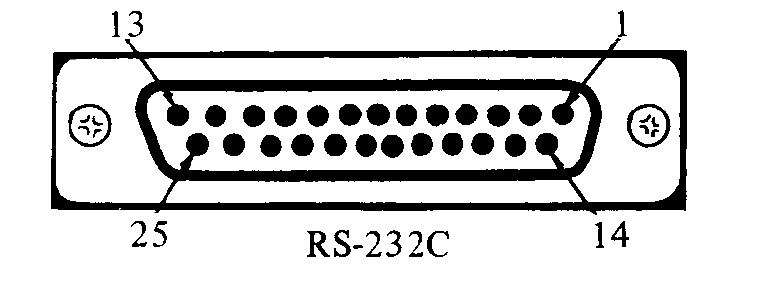
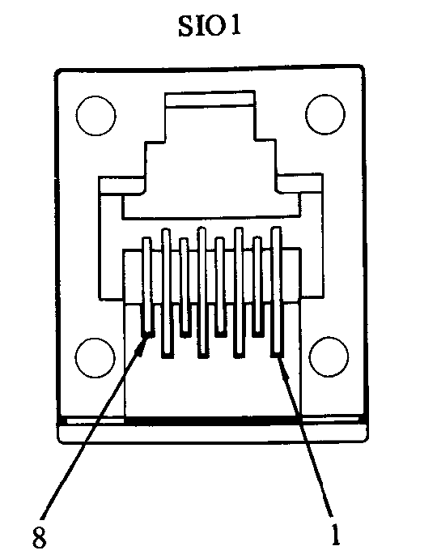
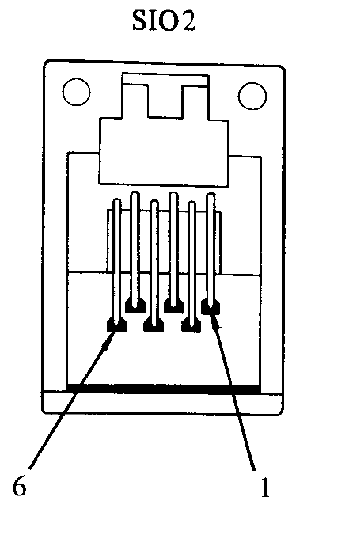
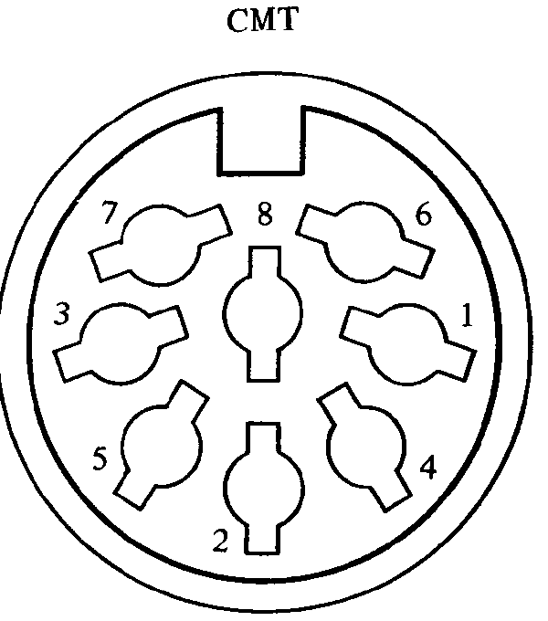
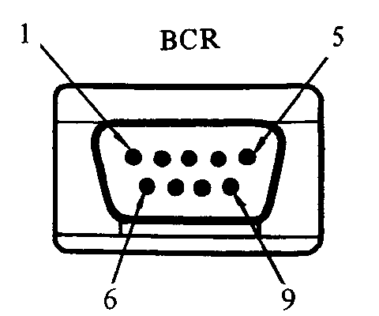
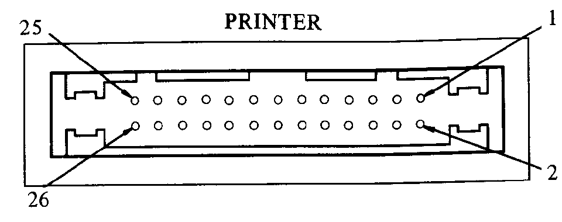
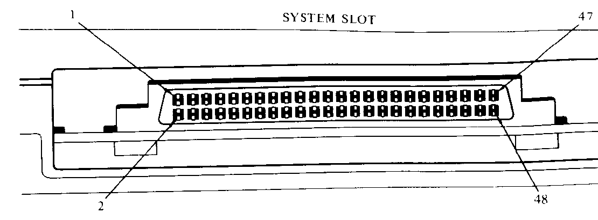

# Appendix B: Optional Equipment Available for PC-8201

> Vision-OCR'd from NEC8201A-UsersGuide.pdf (image-only scan, source pages 191-202 / printed B-1..B-12), 2026-05-30.
> Tier B vision review complete: illustrations cropped from the source scan, pin/spec tables verified cell-by-cell against the page images.

## The Interface Connectors

<!-- OCR: unclear ("Ibe Interface Connectors") — reads as "The Interface Connectors" -->

### RS-232C — 25 pin D SUB

<!-- source page 191 -->

| Pin number | Signal name | Remarks |
|---|---|---|
| 1 | GND | Protective ground |
| 2 | TxD | Transmit data |
| 3 | RxD | Receive data |
| 4 | RTS | Request to send |
| 5 | CTS | Transmission authorized |
| 6 | DSR | Data set relay |
| 7 | GND | Signal ground |
| 8 | DCD | Data carrier detect |
| to | | |
| 20 | DTR | Data carrier ready |
| 22 | RD | Bell detect |
| 25 | - - - | |

### SIO1 — 8 pin DuPont BERG modular jack

<!-- source page 192 -->

| Pin number | Signal name | Remarks |
|---|---|---|
| 1 | GND | Signal ground |
| 2 | TxD | Transmit data |
| 3 | RxR | Receive data |
| 4 | RTS | Request to receive |
| 5 | CTS | Transmission authorized |
| 6 | Vcc | +5 V |
| 7 | NC | Not connected |
| 8 | NC | Not connected |

### SIO2 — 6 pin DuPont BERG modular jack

<!-- source page 193 -->

| Pin number | Signal name | Remarks |
|---|---|---|
| 1 | GND | Signal ground |
| 2 | TxD | Transmit data |
| 3 | RxR | Receive data |
| 4 | RTS | Request to receive |
| 5 | CTS | Transmission authorized |
| 6 | Vcc | +5 V |

### CMT — 8 pin DIN plug

<!-- source page 194 -->

| Pin number | Signal name | Remarks |
|---|---|---|
| 1 | T x C | TTL level output |
| 2 | GND | Signal ground |
| 3 | GND | Electrical power ground |
| 4 | MIC | Output to a MIC |
| 5 | EAR | Input from EAR |
| 6 | REM1 | Remote terminal |
| 7 | REM2 | Remote terminal |
| 8 | Vcc | +5 V |

### BCR — 9 pin D SUB

<!-- source page 195 -->

| Pin number | Signal name | Remarks |
|---|---|---|
| 1 | NC | Not connected |
| 2 | R x DB | Receive data |
| 3 | NC | Not connected |
| 4 | NC | Not connected |
| 5 | GND | Signal ground |
| 6 | NC | Not connected |
| 7 | GND | Signal ground |
| 8 | NC | Not connected |
| 9 | Vcc | +5 V |

### Printer — 26 pin connector using a flat cable

<!-- source page 196 -->

| Pin number | Signal name | Remarks | Pin number | Signal name | Remarks |
|---|---|---|---|---|---|
| 1 | STROBE | WRITE strobe | 2 | GND | Signal ground |
| 3 | PD0 | Parallel data 0 | 4 | GND | Signal ground |
| 5 | PD1 | Parallel data 1 | 6 | GND | Signal ground |
| 7 | PD2 | Parallel data 2 | 8 | GND | Signal ground |
| 9 | PD3 | Parallel data 3 | 10 | GND | Signal ground |
| 11 | PD4 | Parallel data 4 | 12 | GND | Signal ground |
| 13 | PD5 | Parallel data 5 | 14 | GND | Signal ground |
| 15 | PD6 | Parallel data 6 | 16 | GND | Signal ground |
| 17 | PD7 | Parallel data 7 | 18 | GND | Signal ground |
| 19 | NC | | 20 | GND | Signal ground |
| 21 | BUSY | Printer busy | 22 | GND | Signal ground |
| 23 | NC | | 24 | GND | Signal ground |
| 25 | SLCT | Printer select | 26 | NC | |

### System Slot

<!-- source page 197 -->

| Pin number | Signal name | Remarks |
|---|---|---|
| 1 | VDD | +5 V |
| 2 | VDD | +5 V |
| 3 | AD0 | Address/Data 0 |
| 4 | AD4 | Address/Data 4 |
| 5 | AD1 | Address/Data 1 |
| 6 | AD5 | Address/Data 5 |
| 7 | AD2 | Address/Data 2 |
| 8 | AD6 | Address/Data 6 |
| 9 | AD3 | Address/Data 3 |
| 10 | AD7 | Address/Data 7 |
| 11 | NC | No Connection |
| 12 | NC | No Connection |
| 13 | A8 | Address 8 |
| 14 | A12 | Address 12 |
| 15 | A9 | Address 9 |
| 16 | A13 | Address 13 |
| 17 | A10 | Address 10 |
| 18 | A14 | Address 14 |
| 19 | A11 | Address 11 |
| 20 | A15 | Address 15 |
| 21 | A16 | No Connection |
| 22 | A18 | No Connection |
| 23 | A17 | No Connection |
| 24 | A19 | No Connection |
| 25 | NC | No Connection |
| 26 | NC | No Connection |
| 27 | RD | Read |
| 28 | WR | Write |
| 29 | IO/M | IO OR Memory |
| 30 | ALE | Address Latch Enable |
| 31 | HOLD | HOLD |
| 32 | HOLDA | HOLD Acknowledge |
| 33 | INTR | INTERRUPT |
| 34 | INTA | INTER Acknowledge |
| 35 | RESET | RESET |
| 36 | READY | READY |
| 37 | ROME | ROM Enable |
| 38 | E | Enable |
| 39 | BANK#3 | RAM Cassette Select signal |
| 40 | NC | No Connection |
| 41 | HADRD | High Address Disable |
| 42 | LADRD | Low Address Disable |
| 43 | CLK | Clock |
| 44 | POWER | RAM Protect signal |
| 45 | GND | Ground |
| 46 | GND | Ground |
| 47 | NC | No Connection |
| 48 | NC | No Connection |

<!-- OCR: pins 15-48 verified cell-by-cell against source pages 198 (B-8) and 199 (B-9). Note: scan prints overbars (active-low) on pin 28 WR, pin 37 ROME, and pin 39 BANK#3; overbar notation not represented in this table. -->

## Audio Cassette-Related

| Model number | Item name | Function |
|---|---|---|
| PC-6082 | Data Recorder | Audio cassette tape recorder for use with a personal computer |
| PC-8281 | Data Recorder | Audio cassette tape recorder with automatic search function for use with a personal computer |

— It is possible to use any commercially-marketed audio cassette recorder.

Please use the PC-8293 CMT cable that is packed with the PC-8201 when you purchase it to connect it to an audio cassette recorder. The PC-8093 can also be used.

<!-- OCR verified against source page 200: scan literally prints "PC-8093" (likely an original-document typo for PC-8293; transcribed verbatim). -->

The following items are new products to be included in the PC-8201 series.

| Model number | Item name | Function |
|---|---|---|
| PC-8201-06 | RAM Expansion | The RAM can be expanded within the CPU by the addition of 8K byte increments |
| PC-8201-90 | Exclusive nickel-cadmium batteries | Nickel-cadmium batteries for use with the PC-8201 |
| PC-8206 | RAM Cartridge | Plugged into the PC-8201 System slot; contains 32K byte RAM |
| PC-8271-01 | AC Adapter | AC Adapter for running the PC-8201 off of 120 V AC |
| PC-8293 | CMT Cable | 80 cm long CMT cable for use with the PC-8201 |
| PC-8294 | Printer Cable | Printer cable for use with the PC-8201 |
| PC-8295-N | RS-232C cable | Normal connection |
| PC-8295-R | | Reverse connection |
| PC-8299-6 | SIO2 cable | 6 pin further expansion |
| PC-8299-8 | SIO1 cable | 8 pin further expansion |

<!-- OCR: rows PC-8271-01 through PC-8299-8 verified cell-by-cell against source page 201 (B-11). -->

## Printer related

| Model number | Item name | Function |
|---|---|---|
| PC-6021 | 40 column thermal printer | 40 column thermal printer (The PC-8294 cable required for use is sold separately.) |
| PC-6022 | Color plotter printer | 4 color conversion color plotter printer with ball point pens; 40 or 80 column character printing |
| PC-8023A-C | Dot matrix | 80 column, dot matrix printer with graphics capability (PC-8294 cable is sold separately) |
| PC-8023-01 | Ink ribbon cartridge | Ink ribbon cartridge for use in the PC-8023-C |
| PC-8221 | Thermal dot matrix printer | 40 or 80 column thermal dot matrix printer with graphics capability (The printer cable is attached to this.) |
