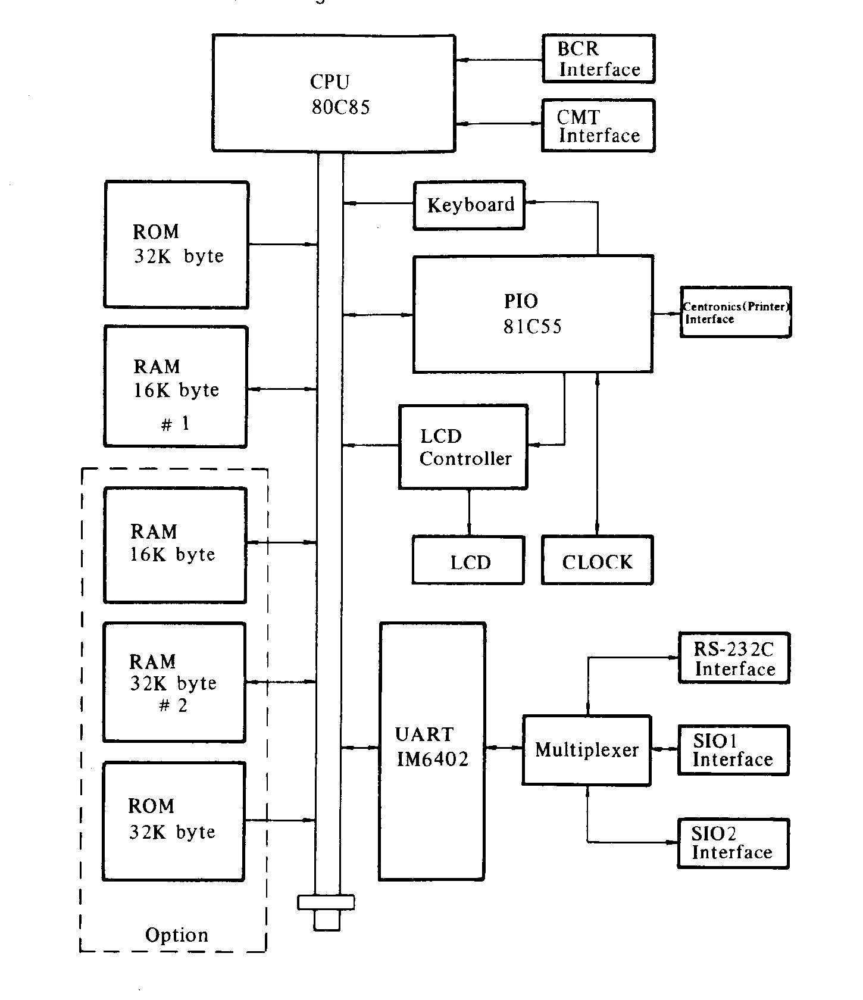

# Appendix C: Tables & Diagrams

> Vision-OCR'd from NEC8201A-UsersGuide.pdf (image-only scan, source pages 203-210 / printed C-1..C-8), 2026-05-30.
> Tier B vision review complete: memory maps rendered as block-beta, function-block diagram cropped, character-code tables verified against the source scan (dense tables read at 500dpi; see inline tier-b notes for human spot-check items).

## Memory Maps

### Memory Map 1

<!--
NOTATION RECONCILIATION (source mixes decimal and hex):
The scanned diagram on source page 203 labels three boundaries as bare digits:
"65535" (top), "62336" (File-control-block base), and "8000" (bottom / BASIC-file base).
"65535" and "62336" are DECIMAL (65535 = top of the 64K space; 62336 = Work-area base).
"8000", however, is HEX: ^X8000 = 32768 decimal, the RAM / BASIC-file base address.
A bare decimal 8000 would be ^X1F40, which is nonsensical as the RAM base, so the
source intermixed notations. The map below is reconciled to ONE system: hex with the
^X prefix for boundary addresses. Decimal equivalents for human verification:
  ^XFFFF = 65535  (top, Work-area top)
  ^XF380 = 62336  (File-control-block base, per source label)
  ^X8000 = 32768  (RAM / BASIC-program-file base; source printed this as bare "8000" = hex)
-->

```block-beta
columns 1
  top["^XFFFF (65535)"]
  a["Work area"]
  fcb["^XF380 (62336)"]
  b["File control block (changes according to MAXFILES)"]
  c["String region (changes according to CLEAR statement number 1 parameter)"]
  d["FOR/GOSUB stack"]
  e["System stack"]
  f["(free space)"]
  g["Array region"]
  h["Pure variable region"]
  i["Machine language program file .CO"]
  j["ASCII code text file .DO"]
  k["BASIC program file .BA"]
  base["^X8000 (32768)"]
```

Note: the source labels the top of the block "65535", the File-control-block
boundary "62336", and the bottom of the block "8000". The first two are bare
decimals; "8000" is hex (^X8000 = 32768). See the reconciliation comment above.

### Memory Map 2

<!--
Source page 204. Boundaries printed as bare DECIMALS: 65535 / 32768 (upper band),
32767 / 0 (lower band). Hex equivalents: ^X0000 (0) ROM base, ^X7FFF (32767) ROM end,
^X8000 (32768) RAM / bank boundary, ^XFFFF (65535) top.
Upper band (^X8000-^XFFFF, 32768-65535): RAM 16K #1 over RAM 16K (option), and
the separate option columns RAM 32K #2 and RAM 32K #3 / RAM cartridge.
Lower band (^X0000-^X7FFF, 0-32767): System ROM 32K, plus dashed/optional slots.
-->

```block-beta
columns 4
  block:upper:4
    columns 4
    a["^XFFFF (65535)\nRAM 16K #1\n- - - -\nRAM 16K (option)\n^X8000 (32768)"]
    b["(empty)"]
    c["RAM 32K #2 (option)"]
    d["RAM 32K #3 / RAM cartridge"]
  end
  block:lower:4
    columns 4
    e["^X7FFF (32767)\nSystem ROM 32K\n^X0000 (0)"]
    f["(empty)"]
    g["(dashed / optional)"]
    h["(dashed / optional)"]
  end
```

- The addresses for RAM #2 and RAM #3 can be designated as either 0 through 32767 (^X0000-^X7FFF) or 32768 through 65535 (^X8000-^XFFFF).
- Each block can affect a bank conversion in 32K byte segments.

## Character Code Table

The Character Code Table spans source pages 205-209 (printed C-3..C-7),
decimal codes 0-255. Codes 0-31 are the Control Code Table (unique codes that
cannot be output as characters); a continuous code/character grid follows.
Cross-checked against the shared glossary; the BASIC Reference's Appendix A is
the authoritative key for char/control codes.

### Decimal 0-53 (source page 205, printed C-3)

| Decimal | Character |
|---|---|
| 0 | (Control Code Table — unique code that cannot be output as characters) |
| 1 | (control code) |
| 2 | (control code) |
| 3 | (control code) |
| 4 | (control code) |
| 5 | (control code) |
| 6 | (control code) |
| 7 | (control code) |
| 8 | (control code) |
| 9 | (control code) |
| 10 | (control code) |
| 11 | (control code) |
| 12 | (control code) |
| 13 | (control code) |
| 14 | (control code) |
| 15 | (control code) |
| 16 | (control code) |
| 17 | (control code) |
| 18 | (control code) |
| 19 | (control code) |
| 20 | (control code) |
| 21 | (control code) |
| 22 | (control code) |
| 23 | (control code) |
| 24 | (control code) |
| 25 | (control code) |
| 26 | (control code) |
| 27 | (control code) |
| 28 | (control code) |
| 29 | (control code) |
| 30 | (control code) |
| 31 | (control code) |
| 32 | (space) |
| 33 | ! |
| 34 | " |
| 35 | # |
| 36 | $ |
| 37 | % |
| 38 | & |
| 39 | ' |
| 40 | ( |
| 41 | ) |
| 42 | * |
| 43 | + |
| 44 | , |
| 45 | - |
| 46 | . |
| 47 | / |
| 48 | 0 |
| 49 | 1 |
| 50 | 2 |
| 51 | 3 |
| 52 | 4 |
| 53 | 5 |

<!-- tier-b: char codes 0-53 verified against opus@500dpi read of source page 205; dense table — human spot-check recommended (review issue) -->

### Decimal 54-110 (source page 206, printed C-4)

| Decimal | Character |
|---|---|
| 54 | 6 |
| 55 | 7 |
| 56 | 8 |
| 57 | 9 |
| 58 | : |
| 59 | ; |
| 60 | < |
| 61 | = |
| 62 | > |
| 63 | ? |
| 64 | @ |
| 65 | A |
| 66 | B |
| 67 | C |
| 68 | D |
| 69 | E |
| 70 | F |
| 71 | G |
| 72 | H |
| 73 | I |
| 74 | J |
| 75 | K |
| 76 | L |
| 77 | M |
| 78 | N |
| 79 | O |
| 80 | P |
| 81 | Q |
| 82 | R |
| 83 | S |
| 84 | T |
| 85 | U |
| 86 | V |
| 87 | W |
| 88 | X |
| 89 | Y |
| 90 | Z |
| 91 | [ |
| 92 | ¥ |
| 93 | ] |
| 94 | ^ |
| 95 | ‾ |
| 96 | \ |
| 97 | a |
| 98 | b |
| 99 | c |
| 100 | d |
| 101 | e |
| 102 | f |
| 103 | g |
| 104 | h |
| 105 | i |
| 106 | j |
| 107 | k |
| 108 | l |
| 109 | m |
| 110 | n |

<!-- OCR: code 94 printed as a rounded upward arc (PC-8201 circumflex glyph), transcribed as ^; code 95 printed as a centered overbar ‾ (not a baseline underscore _); code 96 printed as a backslash \ -->
<!-- tier-b: char codes 54-110 verified against opus@500dpi read of source page 206; dense table — human spot-check recommended (review issue) -->

### Decimal 111-167 (source page 207, printed C-5)

| Decimal | Character |
|---|---|
| 111 | o |
| 112 | p |
| 113 | q |
| 114 | r |
| 115 | s |
| 116 | t |
| 117 | u |
| 118 | v |
| 119 | w |
| 120 | x |
| 121 | y |
| 122 | z |
| 123 | { |
| 124 | \| |
| 125 | } |
| 126 | ~ |
| 127 | (none shown) |
| 128 | ◀ (left-pointing filled triangle) |
| 129 | ↵ (return / carriage-return arrow symbol) |
| 130 | ■ (solid block) |
| 131 | (User-defined characters — Potential to be input from the Keyboard) |
| 132 | (user-defined) |
| 133 | (user-defined) |
| 134 | (user-defined) |
| 135 | (user-defined) |
| 136 | (user-defined) |
| 137 | (user-defined) |
| 138 | (user-defined) |
| 139 | (user-defined) |
| 140 | (user-defined) |
| 141 | (user-defined) |
| 142 | (user-defined) |
| 143 | (user-defined) |
| 144 | (user-defined) |
| 145 | (user-defined) |
| 146 | (user-defined) |
| 147 | (user-defined) |
| 148 | (user-defined) |
| 149 | (User-defined characters — Potential to be input from the Keyboard) |
| 150 | (user-defined) |
| 151 | (user-defined) |
| 152 | (user-defined) |
| 153 | (user-defined) |
| 154 | (user-defined) |
| 155 | (user-defined) |
| 156 | (user-defined) |
| 157 | (user-defined) |
| 158 | (user-defined) |
| 159 | (user-defined) |
| 160 | (user-defined) |
| 161 | (blank) |
| 162 | (blank) |
| 163 | (blank) |
| 164 | (blank) |
| 165 | (blank) |
| 166 | (blank) |
| 167 | (blank) |

Note: in the source, a single "User-defined characters (Potential to be input
from the Keyboard)" annotation runs vertically alongside codes 131-160. The
annotation begins in the second column just after a dashed line below code 130
(so it covers 131-148) and continues in the third column (149-160), where a
second dashed line falls below code 160. Codes 161-167 are below that dashed
line and are blank/unannotated. No glyphs are printed for any of the
user-defined codes — those cells are intentionally blank in the source.

<!-- tier-b: char codes 111-167 verified against opus@500dpi read of source page 207; dense graphics table — human spot-check recommended (review issue) -->

### Decimal 168-223 (source page 208, printed C-6)

All cells in codes 168-223 are blank in the source (continuation of the
user-defined range). A dashed line falls below 223.

| Decimal | Character |
|---|---|
| 168 | (blank) |
| 169 | (blank) |
| 170 | (blank) |
| 171 | (blank) |
| 172 | (blank) |
| 173 | (blank) |
| 174 | (blank) |
| 175 | (blank) |
| 176 | (blank) |
| 177 | (blank) |
| 178 | (blank) |
| 179 | (blank) |
| 180 | (blank) |
| 181 | (blank) |
| 182 | (blank) |
| 183 | (blank) |
| 184 | (blank) |
| 185 | (blank) |
| 186 | (blank) |
| 187 | (blank) |
| 188 | (blank) |
| 189 | (blank) |
| 190 | (blank) |
| 191 | (blank) |
| 192 | (blank) |
| 193 | (blank) |
| 194 | (blank) |
| 195 | (blank) |
| 196 | (blank) |
| 197 | (blank) |
| 198 | (blank) |
| 199 | (blank) |
| 200 | (blank) |
| 201 | (blank) |
| 202 | (blank) |
| 203 | (blank) |
| 204 | (blank) |
| 205 | (blank) |
| 206 | (blank) |
| 207 | (blank) |
| 208 | (blank) |
| 209 | (blank) |
| 210 | (blank) |
| 211 | (blank) |
| 212 | (blank) |
| 213 | (blank) |
| 214 | (blank) |
| 215 | (blank) |
| 216 | (blank) |
| 217 | (blank) |
| 218 | (blank) |
| 219 | (blank) |
| 220 | (blank) |
| 221 | (blank) |
| 222 | (blank) |
| 223 | (blank) |

<!-- tier-b: char codes 168-223 verified against opus@500dpi read of source page 208; dense graphics table — human spot-check recommended (review issue) -->

### Decimal 224-255 (source page 209, printed C-7)

Codes 224-242 (first column) are annotated "User-defined characters (Output by
using the CHS$ function)"; codes 243-255 (second column) are annotated
"Characters (Output by using the CHS$ function)". A solid horizontal rule
closes the table below code 255. No glyphs are printed for any of these codes —
the cells are intentionally blank in the source.

| Decimal | Character |
|---|---|
| 224 | (User-defined characters — Output by using the CHS$ function) |
| 225 | (user-defined, CHS$) |
| 226 | (user-defined, CHS$) |
| 227 | (user-defined, CHS$) |
| 228 | (user-defined, CHS$) |
| 229 | (user-defined, CHS$) |
| 230 | (user-defined, CHS$) |
| 231 | (user-defined, CHS$) |
| 232 | (user-defined, CHS$) |
| 233 | (user-defined, CHS$) |
| 234 | (user-defined, CHS$) |
| 235 | (user-defined, CHS$) |
| 236 | (user-defined, CHS$) |
| 237 | (user-defined, CHS$) |
| 238 | (user-defined, CHS$) |
| 239 | (user-defined, CHS$) |
| 240 | (user-defined, CHS$) |
| 241 | (user-defined, CHS$) |
| 242 | (user-defined, CHS$) |
| 243 | (Characters — Output by using the CHS$ function) |
| 244 | (CHS$) |
| 245 | (CHS$) |
| 246 | (CHS$) |
| 247 | (CHS$) |
| 248 | (CHS$) |
| 249 | (CHS$) |
| 250 | (CHS$) |
| 251 | (CHS$) |
| 252 | (CHS$) |
| 253 | (CHS$) |
| 254 | (CHS$) |
| 255 | (CHS$) |

<!-- tier-b: char codes 224-255 verified against opus@500dpi read of source page 209; dense graphics table — human spot-check recommended (review issue) -->

## Function Block Diagram


<!-- source page 210 -->

Block contents transcribed for reference (pictorial diagram on source page 210):

- **CPU 80C85** — connects to BCR Interface and CMT Interface (right side).
- System bus (vertical) connects CPU to: **ROM 32K byte**, **RAM 16K byte #1**,
  and (inside a dashed "Option" box) **RAM 16K byte**, **RAM 32K byte #2**,
  **ROM 32K byte**.
- **Keyboard** → CPU/PIO.
- **PIO 81C55** → **Centronics (Printer) Interface**.
- **LCD Controller** → **LCD**; **CLOCK** block adjacent.
- **UART IM6402** → **Multiplexer** → **RS-232C Interface**, **SIO1 Interface**,
  **SIO2 Interface**.

<!-- OCR: unclear (PIO labelled "81C55" in this diagram; the shared glossary canonical is "8155"/"8155S" — left as printed) -->
