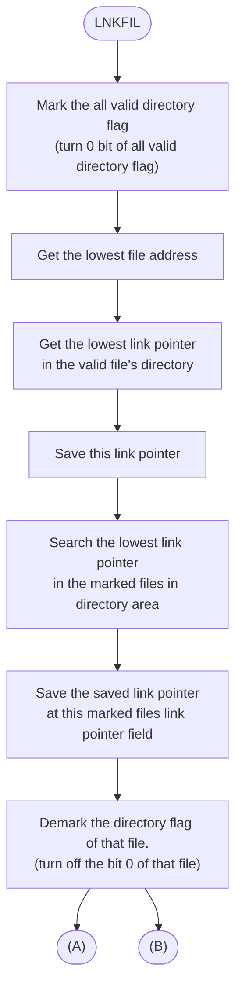

# claude-sonnet-4-6 — p130 (Fig 8.5 Internal flow of LNKFIL, flowchart)

## 1. Faithful transcription (boxes top→bottom)
1. `LNKFIL` (entry, rounded)
2. Mark the all valid directory flag (turn 0 bit of all valid directory flag)
3. Get the lowest file address
4. Get the lowest link pointer in the valid file's directory
5. Save this link pointer
6. Search the lowest link pointer in the marked files in directory area
7. Save the saved link pointer at this marked files link pointer field
8. Demark the directory flag of that file. (turn off the bit 0 of that file)

Off-page connectors at bottom: `(A)` left, `(B)` right.

## 2. Mermaid translation

Note: sonnet inferred a `B4 -.->|loop back| B5` edge from a `|<---` line in the
ASCII. That backward edge is **unverified** — the `|<---` may be the (B)
connector rail, not a loop. Flag for human check against p131 (the A/B continuation).
