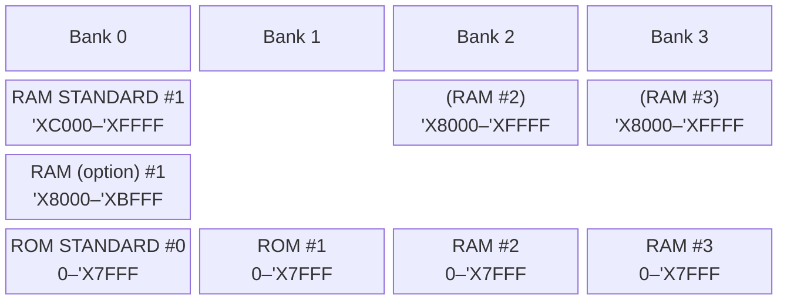

# claude-opus-4-8 vision pass — p15 (Fig 2.1 Memory Map)

## 1. Faithful transcription

Address labels down the left edge (top → bottom):
`^XFFFF`, `^XC000`, `^XBFFF`, `^X8000`, `^X7FFF`, `0`
(printed with a caret-X prefix in the scan; native assembler notation is `'X`.)

Columns: **Bank 0**, **Bank 1**, **Bank 2**, **Bank 3**

| Address span | Bank 0 | Bank 1 | Bank 2 | Bank 3 |
|---|---|---|---|---|
| `'XC000`–`'XFFFF` | RAM STANDARD #1 | — | (RAM #2 ) | (RAM #3) |
| `'X8000`–`'XBFFF` | RAM (option) #1 | — | (RAM #2 ) | (RAM #3) |
| `0`–`'X7FFF` | ROM STANDARD #0 | ROM #1 | RAM #2 | RAM #3 |

- Bank 0 upper half splits at `'XC000`/`'XBFFF`: RAM STANDARD #1 above, RAM (option) #1 below.
- Banks 2 & 3 upper blocks `(RAM #2 )` / `(RAM #3)` span the whole `'X8000`–`'XFFFF` range (parenthesised — optional/relocatable).
- Bank 1 has only the lower `0`–`'X7FFF` block (ROM #1); its upper half is empty.
- Footer labels: "Main memory" under Bank 0; "RAM cartridge" under Banks 2–3.
- Caption: `Fig 2.1 PC-8201A MEMORY MAP`

## 2. Mermaid translation

Notes: `block-beta` approximates the 2D bank/address grid. Bank 0's top cell is the only one split at `'XC000`. The footer grouping (Main memory = Bank 0; RAM cartridge = Banks 2–3) isn't expressible inline in block-beta without extra rows.
