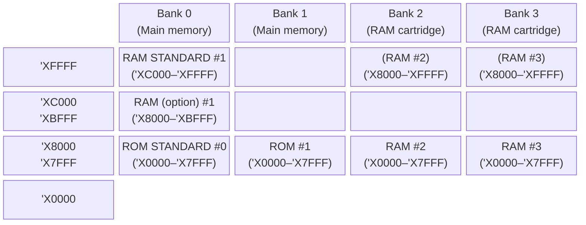

# claude-sonnet-4-6 vision pass — p15 (Fig 2.1 Memory Map)

(Produced by a sonnet subagent reading renders/p15-300-015.png.)

## 1. Faithful transcription

Address labels (left, top→bottom): `^XFFFF`, `^XC000`, `^XBFFF`, `^X8000`, `^X7FFF`, `0`

- **Bank 0 (Main memory):**
  - `^XFFFF`–`^XC000`: RAM STANDARD #1
  - `^XBFFF`–`^X8000`: RAM (option) #1
  - `^X7FFF`–`0`: ROM STANDARD #0
- **Bank 1:** upper half empty; `^X7FFF`–`0`: ROM #1
- **Bank 2:** `^XFFFF`–`^X8000`: (RAM #2 ); `^X7FFF`–`0`: RAM #2
- **Bank 3 (RAM cartridge):** `^XFFFF`–`^X8000`: (RAM #3); `^X7FFF`–`0`: RAM #3

Caption: `Fig 2.1 PC-8201A MEMORY MAP`

## 2. Mermaid translation

